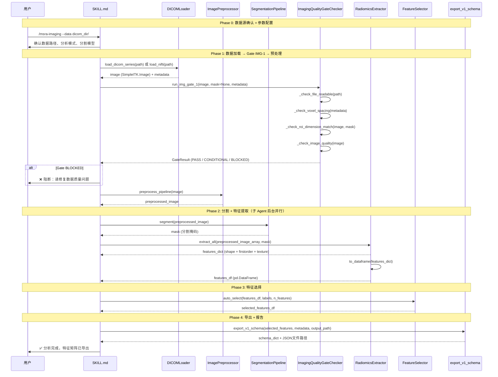
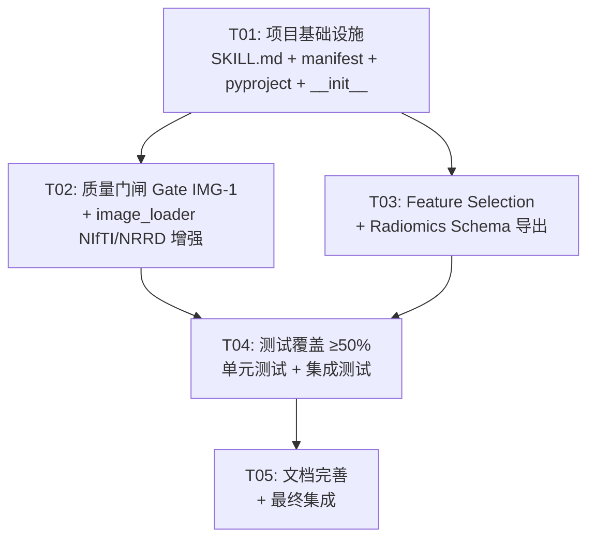

# Medical Imaging 模块系统设计

> **版本**: v1.0 | **日期**: 2026-06-24 | **设计者**: Bob (Architect)

---

## Part A: 系统设计

### 1. 实现方案

#### 1.1 核心技术挑战

1. **多格式影像支持**: DICOM（单文件/序列目录）、NIfTI (.nii/.nii.gz)、NRRD 三种格式的统一加载入口
2. **质量门闸设计**: 复用 `src/shared/quality_gates/` 框架的 `GateRunner + CheckItemResult` 模式，实现 Gate IMG-1（4 项检查）
3. **Feature Selection 补全**: `radiomics.py` 中仅有 `extract_all` 但缺少特征选择/降维/过滤能力，需新增独立模块
4. **结果 Schema 导出**: 需定义 `msra/imaging_features/v1` 的 JSON Schema，使 Radiomics 特征矩阵可直接接入主 Pipeline Stage 3
5. **测试覆盖 ≥50%**: 涉及 SimpleITK/MONAI 等重依赖，需大量 mock 策略

#### 1.2 框架与库选型

| 选择 | 理由 |
|------|------|
| **nibabel** | NIfTI 标准库，轻量高效 |
| **SimpleITK** | 已在 image_loader/preprocessing/registration 中使用，保持一致 |
| **scikit-learn** | Feature selection 经典库（mutual_info, variance threshold, recursive feature elimination） |
| **scikit-image** | 已在 radiomics.py 的 GLCM 计算中使用 |
| **GateRunner 框架** | 复用 src/shared/quality_gates/ 的统一模式，保持 bioinformatics 和 imaging 门闸设计一致 |

#### 1.3 架构模式

**方案C — Skill 入口 + Agent 执行**（与 bioinformatics 模块一致）：

```
用户: /msra-imaging --data dicom_dir/
  │
  ▼
SKILL.md (Phase 0-4): 用户交互 + 流程编排 + 质量门闸
  │
  ▼ (重计算)
Python Engine: msra_modules/medical_imaging/
  ├─ image_loader.py    → DICOM/NIfTI/NRRD 加载
  ├─ preprocessing.py   → 预处理
  ├─ segmentation.py    → 分割
  ├─ radiomics.py       → 特征提取
  ├─ feature_selection.py → 特征选择 [新增]
  ├─ quality_gates.py   → Gate IMG-1 [新增]
  ├─ registration.py    → 配准
  └─ visualization.py   → 可视化
```

**关键设计决策**:

1. **`feature_selection.py` 独立于 `radiomics.py`**: 遵循单一职责原则，`RadiomicsExtractor` 负责提取，`FeatureSelector` 负责选择/过滤
2. **`quality_gates.py` 复用 `BioQualityGateChecker` 的 `_build_gate_result` 模式**: 手动构建 `GateResult`，而非注册到 `GATE_REGISTRY`（因为 IMG-1 是自定义门闸）
3. **NIfTI/NRRD 支持在 `image_loader.py` 中扩展**: 新增 `load_nifti` 和 `load_nrrd` 方法到 `DICOMLoader`（或新增工厂函数），保持统一入口
4. **结果 Schema 导出**: 在 `radiomics.py` 中新增 `export_schema` 方法，输出 `msra/imaging_features/v1` JSON

---

### 2. 文件列表

```
# === 已存在（需修改/增强）===
msra_modules/medical_imaging/__init__.py          # 更新导出
msra_modules/medical_imaging/image_loader.py       # 增加 NIfTI/NRRD 加载
msra_modules/medical_imaging/radiomics.py          # 增加 export_schema

# === 新增文件 ===
msra_modules/medical_imaging/feature_selection.py  # P0-4: 特征选择模块
msra_modules/medical_imaging/quality_gates.py      # P0-3: Gate IMG-1 质量门闸
skills/imaging-analysis/SKILL.md                   # P0-1: Skill 定义文件
tests/test_medical_imaging/__init__.py             # 测试包
tests/test_medical_imaging/test_image_loader.py    # 加载器测试
tests/test_medical_imaging/test_quality_gates.py   # 门闸测试
tests/test_medical_imaging/test_feature_selection.py # 特征选择测试
tests/test_medical_imaging/test_radiomics.py       # 特征提取测试
tests/test_medical_imaging/test_integration.py     # 集成测试

# === 配置文件（修改）===
manifest.json                                      # P0-2: 注册 /msra-imaging 命令
pyproject.toml                                     # P1-4: 添加 imaging 可选依赖
```

---

### 3. 数据结构和接口

```mermaid
classDiagram
    direction TB

    class DICOMLoader {
        +window_level: Optional[float]
        +window_width: Optional[float]
        +load_dicom_series(dicom_dir: str) SimpleITK.Image
        +load_dicom(dicom_path: str) SimpleITK.Image
        +load_nifti(nifti_path: str) SimpleITK.Image
        +load_nrrd(nrrd_path: str) SimpleITK.Image
        +to_numpy(image) np.ndarray
        +extract_metadata(image) Dict
        +apply_window(image, window_level, window_width) SimpleITK.Image
    }

    class ImagePreprocessor {
        +target_spacing: Optional[Tuple[float, float, float]]
        +normalize: bool
        +resample(image, target_spacing) SimpleITK.Image
        +normalize_intensity(image, method: str) SimpleITK.Image
        +denoise(image, method: str) SimpleITK.Image
        +bias_correction(image) SimpleITK.Image
        +preprocess_pipeline(image) SimpleITK.Image
    }

    class SegmentationPipeline {
        +model_name: str
        +device: str
        +segment(image: np.ndarray) np.ndarray
        +segment_with_confidence(image: np.ndarray) Tuple[np.ndarray, np.ndarray]
    }

    class RadiomicsExtractor {
        +bin_width: float
        +extract_shape_features(mask: np.ndarray) Dict[str, float]
        +extract_firstorder_features(image, mask) Dict[str, float]
        +extract_texture_features(image, mask) Dict[str, float]
        +extract_all(image, mask) Dict[str, Dict[str, float]]
        +to_dataframe(features: Dict) pd.DataFrame
        +export_v1_schema(features, metadata, output_path) Dict
    }

    class FeatureSelector {
        +__init__(methods: List[str], n_features: int)
        +select_variance_threshold(features_df, threshold: float) pd.DataFrame
        +select_k_best(features_df, labels, k: int) pd.DataFrame
        +select_mutual_info(features_df, labels, n_features: int) pd.DataFrame
        +select_rfe(features_df, labels, n_features: int) pd.DataFrame
        +select_correlation_filter(features_df, threshold: float) pd.DataFrame
        +auto_select(features_df, labels, n_features: int) pd.DataFrame
        +get_selected_feature_names() List[str]
    }

    class ImagingQualityGateChecker {
        +study_id: str
        +run_img_gate_1(image_data, mask, metadata) GateResult
        -_check_file_readable(file_path: str) CheckItemResult
        -_check_voxel_spacing(metadata: Dict) CheckItemResult
        -_check_roi_dimension_match(image, mask) CheckItemResult
        -_check_image_quality(image) CheckItemResult
        -_build_gate_result(gate_type, check_results, total_items) GateResult
    }

    class GateRunner {
        <<src/shared/quality_gates>>
        +study_id: str
        +generate_checklist(gate_type, artifacts) str
        +run_gate(gate_type, artifacts, mode, check_results) GateResult
    }

    class CheckItemResult {
        <<src/shared/quality_gates>>
        +item_id: str
        +name: str
        +is_key: bool
        +status: str
        +evidence: str
        +notes: str
    }

    class GateResult {
        <<src/shared/quality_gates>>
        +gate_type: GateType
        +verdict: GateVerdict
        +total_items: int
        +passed_items: int
        +failed_items: int
        +check_results: List[CheckItemResult]
        +risks: List[str]
        +to_dict() Dict
    }

    ImagingQualityGateChecker --> GateRunner : 复用框架
    ImagingQualityGateChecker --> CheckItemResult : 产出
    ImagingQualityGateChecker --> GateResult : 产出
    DICOMLoader ..> RadiomicsExtractor : 影像 → 特征
    RadiomicsExtractor ..> FeatureSelector : 特征矩阵 → 筛选
    SegmentationPipeline ..> RadiomicsExtractor : 掩码 → 特征提取
```



---

### 4. 程序调用流程



---

### 5. 不明确事项

1. **NRRD 支持范围**: NRRD 是否需要支持 `.nhdr` + `.raw` 分体文件格式，还是仅支持 `.nrrd` 单文件？——**假设**: 仅支持 `.nrrd` 单文件
2. **分割模型选择**: `SegmentationPipeline` 依赖 MONAI 预训练模型，在无 MONAI 环境下应降级为阈值分割——**假设**: Skill.md 中标注 MONAI 为可选依赖
3. **Labels 来源**: `FeatureSelector.auto_select` 需要 labels（分类标签），在 Radiomics 场景下标签来源需用户在 Phase 0 提供——**假设**: labels 为外部输入参数
4. **Gate IMG-1 项 4（影像质量）**: 信噪比和伪影检测的具体算法未在 PRD 中定义——**假设**: 使用简化的 SNR 计算（信号均值/背景标准差），伪影检测仅做 NaN/Inf 异常值检查

---

## Part B: 任务分解

### 6. 依赖包列表

```
# 核心依赖（已在 pyproject.toml 中）
numpy>=1.24
scipy>=1.10
pandas>=1.5
scikit-learn>=1.3
matplotlib>=3.7

# imaging 可选依赖组（需添加到 pyproject.toml [project.optional-dependencies]）
nibabel>=4.0
SimpleITK>=2.3
pyradiomics>=3.1
scikit-image>=0.20

# 可选深度学习依赖
# torch>=2.0
# monai>=1.3
```

### 7. 任务列表（按依赖顺序）

---

#### T01: 项目基础设施 + SKILL.md + manifest.json 注册

**Task ID**: T01
**Task Name**: 项目基础设施搭建
**Priority**: P0
**Source Files**:
- `skills/imaging-analysis/SKILL.md` (新建)
- `manifest.json` (修改)
- `pyproject.toml` (修改)
- `msra_modules/medical_imaging/__init__.py` (修改)
- `tests/test_medical_imaging/__init__.py` (新建)

**Dependencies**: 无

**具体内容**:
1. 创建 `skills/imaging-analysis/SKILL.md`：参照 `skills/bioinformatics/SKILL.md` 模板，定义 Phase 0-4 完整流程，包括架构集成图、质量门闸、命令定义、Mode、反例与黑名单
2. 在 `manifest.json` 中注册 `/msra-imaging` 命令（id, entry_point, description, usage, examples）
3. 在 `pyproject.toml` 的 `[project.optional-dependencies]` 中添加 `imaging` 组
4. 更新 `__init__.py` 的 `__all__`（预留 FeatureSelector、ImagingQualityGateChecker）
5. 创建 `tests/test_medical_imaging/__init__.py`

---

#### T02: 质量门闸 Gate IMG-1 + image_loader NIfTI/NRRD 增强

**Task ID**: T02
**Task Name**: 质量门闸 + 多格式加载器
**Priority**: P0
**Source Files**:
- `msra_modules/medical_imaging/quality_gates.py` (新建)
- `msra_modules/medical_imaging/image_loader.py` (修改)
- `tests/test_medical_imaging/test_quality_gates.py` (新建)
- `tests/test_medical_imaging/test_image_loader.py` (新建)

**Dependencies**: T01

**具体内容**:
1. 创建 `quality_gates.py`：实现 `ImagingQualityGateChecker` 类
   - `run_img_gate_1()`: 执行 4 项检查
   - `_check_file_readable()`: [🔑] 文件可读性检查
   - `_check_voxel_spacing()`: [🔑] 体素间距合理性（0.5-5mm）
   - `_check_roi_dimension_match()`: [🔑] ROI 掩膜与影像维度匹配
   - `_check_image_quality()`: [ ] 信噪比 + NaN/Inf 异常检查
   - 复用 `src/shared/quality_gates/` 的 `CheckItemResult`, `GateResult`, `GateType`, `GateVerdict`
2. 在 `image_loader.py` 中新增 `load_nifti()` 和 `load_nrrd()` 工具函数
3. 编写测试：`test_quality_gates.py` 和 `test_image_loader.py`（mock SimpleITK/nibabel）

---

#### T03: Feature Selection 模块 + Radiomics Schema 导出

**Task ID**: T03
**Task Name**: 特征选择 + 结果 Schema 导出
**Priority**: P0
**Source Files**:
- `msra_modules/medical_imaging/feature_selection.py` (新建)
- `msra_modules/medical_imaging/radiomics.py` (修改)
- `tests/test_medical_imaging/test_feature_selection.py` (新建)
- `tests/test_medical_imaging/test_radiomics.py` (新建)

**Dependencies**: T01

**具体内容**:
1. 创建 `feature_selection.py`：实现 `FeatureSelector` 类
   - `select_variance_threshold()`: 方差阈值过滤
   - `select_k_best()`: K-best 特征选择
   - `select_mutual_info()`: 互信息选择
   - `select_rfe()`: 递归特征消除
   - `select_correlation_filter()`: 高相关性过滤
   - `auto_select()`: 自动选择管线（串联多步）
   - `get_selected_feature_names()`: 获取选中特征名
2. 在 `radiomics.py` 中新增 `export_v1_schema()` 方法：输出 `msra/imaging_features/v1` JSON Schema
3. 编写测试：`test_feature_selection.py` 和 `test_radiomics.py`

---

#### T04: 单元测试补充 + 集成测试

**Task ID**: T04
**Task Name**: 测试覆盖 ≥50%
**Priority**: P0
**Source Files**:
- `tests/test_medical_imaging/test_integration.py` (新建)
- `tests/test_medical_imaging/test_quality_gates.py` (补充)
- `tests/test_medical_imaging/test_feature_selection.py` (补充)
- `tests/test_medical_imaging/test_radiomics.py` (补充)

**Dependencies**: T02, T03

**具体内容**:
1. 编写集成测试：完整流程 (load → preprocess → segment → extract → select → export)
2. 补充边界条件测试：空掩码、单体素、超大尺寸、格式兼容性
3. 确保整体测试覆盖率 ≥ 50%（使用 `pytest-cov` 验证）
4. Mock 策略：对 SimpleITK、MONAI、pyradiomics 使用 mock，确保测试不依赖外部库安装

---

#### T05: SKILL.md 完善 + 文档更新 + 最终集成

**Task ID**: T05
**Task Name**: 文档完善 + 最终集成
**Priority**: P1
**Source Files**:
- `skills/imaging-analysis/SKILL.md` (完善)
- `msra_modules/medical_imaging/__init__.py` (最终更新)
- `docs/dev/18-实验性模块设计.md` (更新状态)
- `pyproject.toml` (最终验证)

**Dependencies**: T04

**具体内容**:
1. 完善 SKILL.md 中的质量门闸详细表格、命令说明、Mode 定义
2. 确认 `__init__.py` 导出完整：新增 `FeatureSelector`, `ImagingQualityGateChecker`, `load_nifti`, `load_nrrd`, `export_v1_schema`
3. 更新 `docs/dev/18-实验性模块设计.md` 中 medical_imaging 的状态标记
4. 验证 pyproject.toml 的 imaging 依赖组正确
5. 主 Pipeline 集成接口验证（Stage 3 输入格式兼容性）

---

### 8. 共享知识

```
- 所有质量门闸复用 src/shared/quality_gates/gate_runner.py 中的:
  GateRunner, GateType, GateResult, GateVerdict, CheckItemResult, RunMode
- 门闸判定规则:
  PASS = 全部通过
  CONDITIONAL = 1-2 项未过（非关键项）
  BLOCKED = 3+ 项未过或 🔑 关键项未过
- 门闸检查项 item_id 命名规范:
  bioinformatics: BIO-DG-xx / BIO-RG-xx
  medical_imaging: IMG-DG-xx（数据质量）/ IMG-RG-xx（结果质量）
- SimpleITK 和 nibabel 使用延迟导入模式（_get_sitk()），避免硬依赖
- Radiomics 特征输出格式: Dict[str, Dict[str, float]]，外层 key 为特征类别
- 结果 Schema 版本: msra/imaging_features/v1
- 测试文件中使用 mock 隔离重依赖（SimpleITK, MONAI, pyradiomics）
- Skill.md 遵循 bioinformatics 的 Phase 0-4 编排模式
- manifest.json 的 commands 注册格式与已有 /msra-bio 一致
```

---

### 9. 任务依赖图


