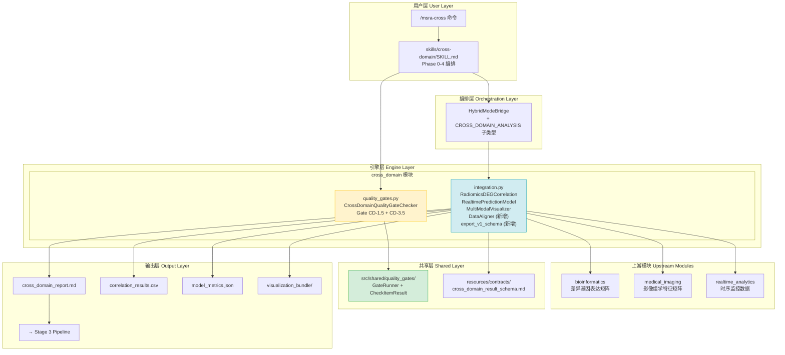
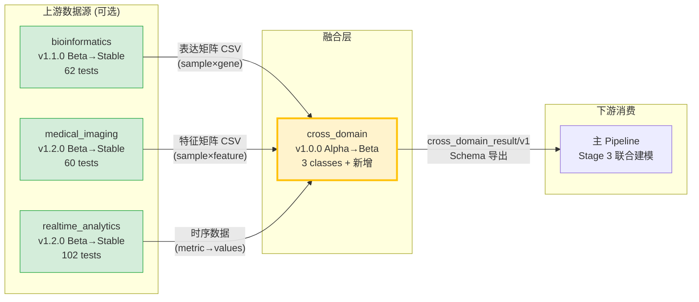
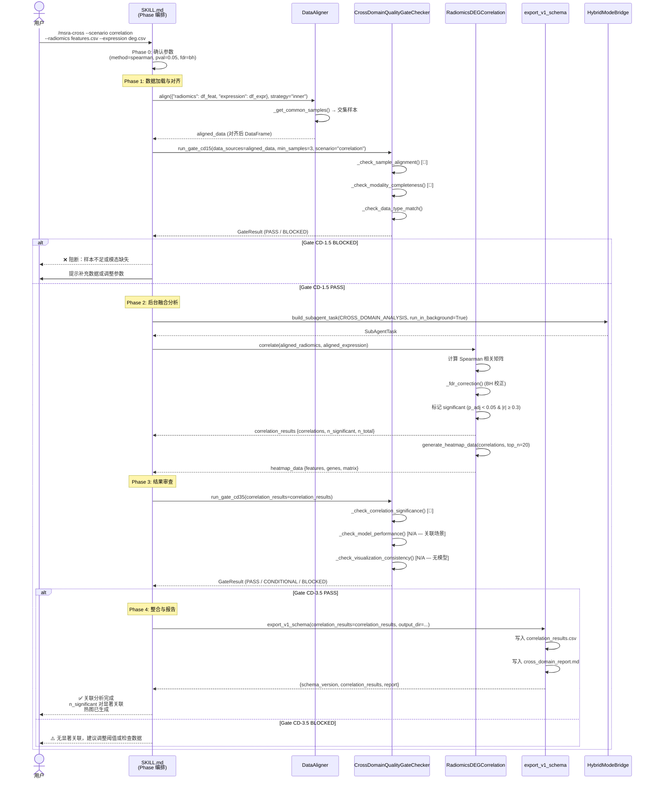
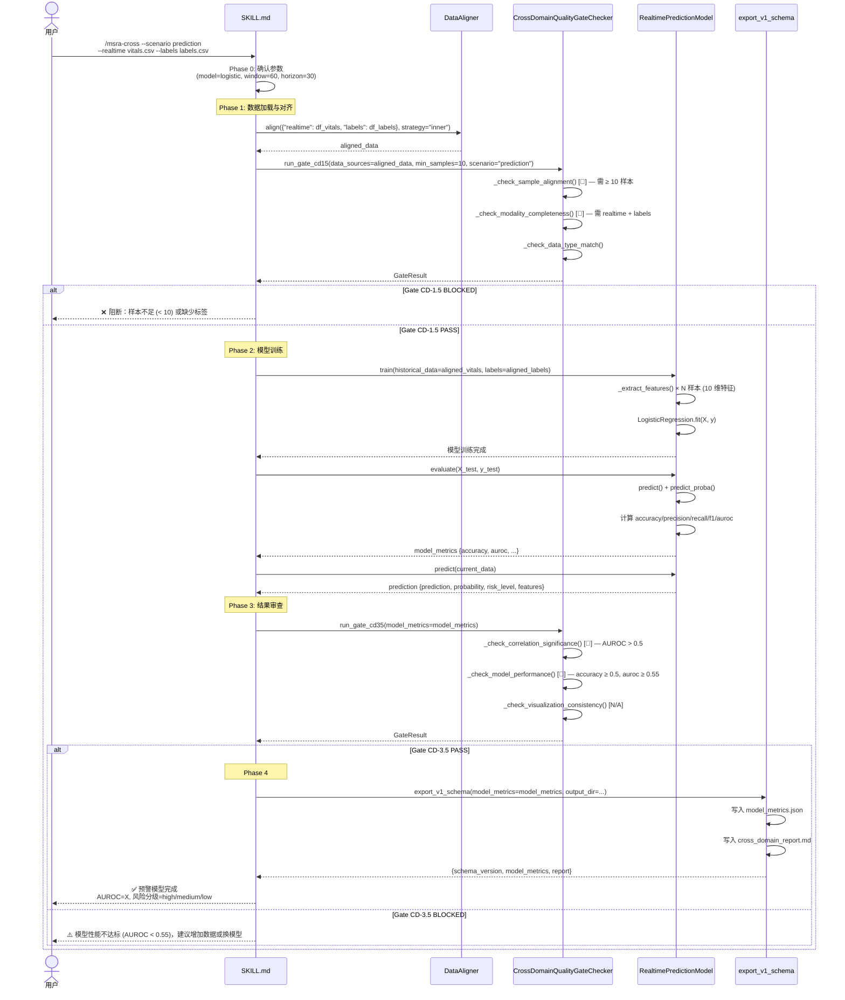
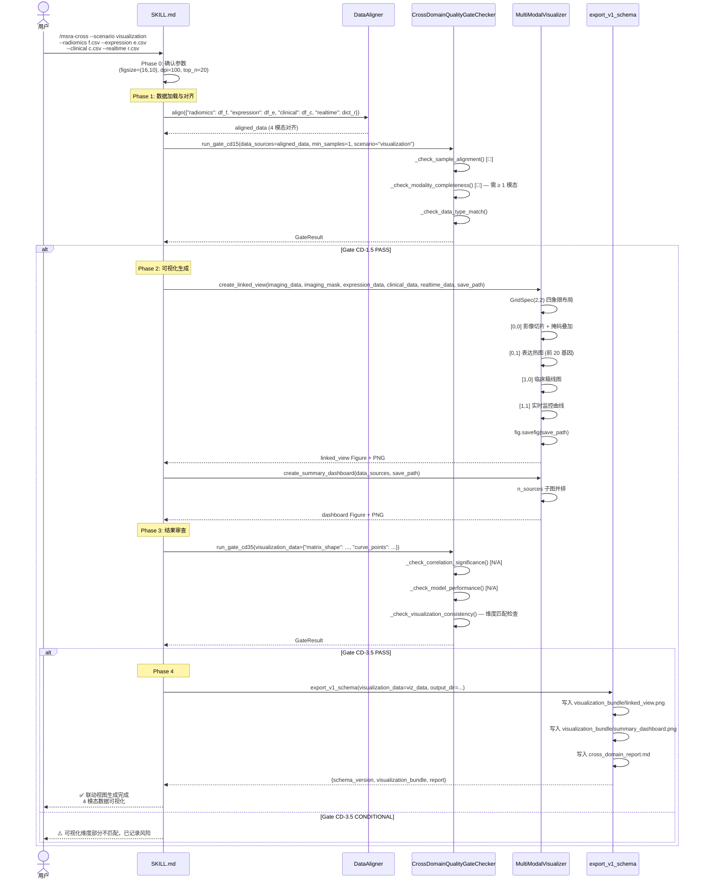
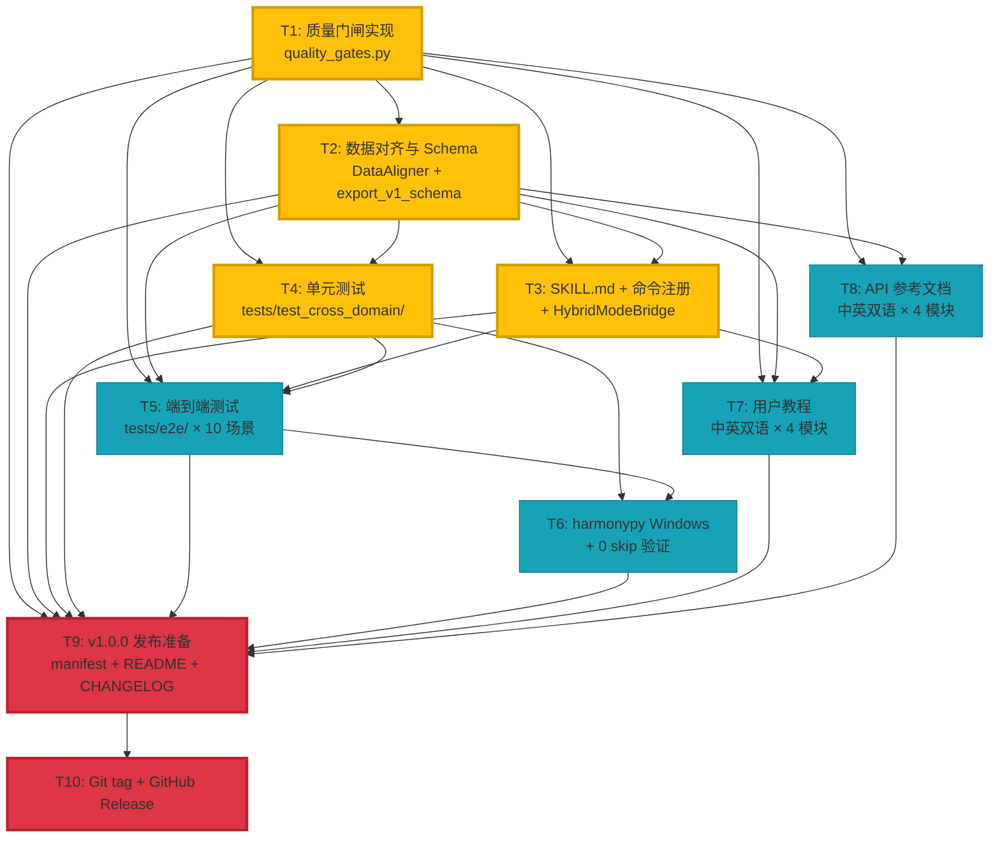

# 系统架构设计 + 任务分解：cross_domain 跨领域融合模块 + v1.0.0 发布

> **版本**: v1.0 | **日期**: 2026-06-25 | **架构师**: 高见远 (Gao)
> **项目**: MSRA (Medical Statistics Research Assistant) | **版本路径**: 0.9.7 → 1.0.0
> **输入**: `docs/prd/cross-domain-module-prd.md` (639 行增量 PRD)

---

## 目录

- [Part A: 系统设计](#part-a-系统设计)
  - [1. 实现方案与框架选型](#1-实现方案与框架选型)
  - [2. 文件列表及相对路径](#2-文件列表及相对路径)
  - [3. 数据结构和接口（类图）](#3-数据结构和接口类图)
  - [4. 程序调用流程（时序图）](#4-程序调用流程时序图)
  - [5. 待明确事项](#5-待明确事项)
- [Part B: 任务分解](#part-b-任务分解)
  - [6. 依赖包列表](#6-依赖包列表)
  - [7. 任务列表（核心交付物）](#7-任务列表核心交付物)
  - [8. 共享知识（跨文件约定）](#8-共享知识跨文件约定)
  - [9. 任务依赖图](#9-任务依赖图)

---

# Part A: 系统设计

## 1. 实现方案与框架选型

### 1.1 核心技术挑战

| # | 挑战 | 分析 | 方案 |
|---|------|------|------|
| C1 | **跨模态数据对齐** | 影像特征矩阵(sample×feature)、表达矩阵(sample×gene)、时序数据(metric→values)三种异构数据需要在样本维度对齐，且不同场景对最低样本数要求不同（关联≥3，预测≥10） | 新增 `DataAligner` 类，支持 inner/outer/time-based 三种策略，默认 inner join（严格匹配） |
| C2 | **质量门闸复用** | 现有 3 个 QualityGateChecker（Bio/IMG/RT）均复用 `src/shared/quality_gates/GateRunner` + `CheckItemResult` + `_build_gate_result()` 模式，cross_domain 需保持一致 | `CrossDomainQualityGateChecker` 完全复用该模式，6 项检查（CD-1.5 三项 + CD-3.5 三项） |
| C3 | **HybridModeBridge 集成** | SubAgentType 当前有 4 种（QC_INSPECTOR/EXEC_INFERENCE/DATA_VALIDATOR/METHOD_CONSULTANT），需新增 CROSS_DOMAIN_ANALYSIS 子类型以支持 Phase 2 后台融合分析 | 在 `SubAgentType` 枚举新增 `CROSS_DOMAIN_ANALYSIS = "cross_domain_analysis"`，添加对应 AGENT_PROMPTS 模板 |
| C4 | **Schema 标准化导出** | 需定义 `msra/cross_domain_result/v1` Schema，与 imaging 的 `msra/imaging_features/v1` 格式保持一致 | 新增 `export_v1_schema()` 函数 + `resources/contracts/cross_domain_result_schema.md` 契约文档 |
| C5 | **harmonypy Windows 编译** | harmonypy 依赖 CMake/nmake，Windows 上编译环境缺失导致 `pip install` 失败，bioinformatics 模块 23 个测试 skip | 三层方案：conda 安装 > 预编译 wheel > WSL 文档说明 |
| C6 | **中英双语文档** | 4 模块 × 2 类型(教程+API) × 2 语言 = 16 份文档，工作量翻倍 | 同步维护策略：`<name>.zh.md` + `<name>.en.md` 双文件，中文为主英文对照，类名/方法名统一英文 |

### 1.2 框架与库选择

| 库 | 版本 | 用途 | 选择理由 |
|----|------|------|---------|
| scipy | ≥1.10 | Pearson/Spearman/Kendall 相关计算 | 核心依赖已有，无需额外安装 |
| scikit-learn | ≥1.3 | LogisticRegression/RandomForestClassifier | 核心依赖已有 |
| matplotlib | ≥3.7 | 多模态联动可视化 | 核心依赖已有 |
| pandas | ≥1.5 | DataFrame 数据处理 | 核心依赖已有 |
| numpy | ≥1.24 | 数值计算 | 核心依赖已有 |

> **关键结论**: cross_domain 模块**无额外运行时依赖**，完全复用核心依赖 + 前三模块的可选依赖。

### 1.3 模块整体架构图



### 1.4 与前三个模块的依赖关系图



**依赖关系说明**:

| 场景 | 上游模块 | 依赖产物 | 数据格式 |
|------|---------|---------|---------|
| A: 影像-基因关联 | medical_imaging + bioinformatics | 特征矩阵 + 表达矩阵 | DataFrame(sample×feature) + DataFrame(sample×gene) |
| B: 实时预警模型 | realtime_analytics | 时序数据 + 标签 | DataFrame(rows×metrics) + ndarray(labels) |
| C: 多模态可视化 | 全部三个模块 | 影像 + 表达 + 临床 + 实时 | ndarray + DataFrame + DataFrame + Dict |
| D: 完整融合 | 全部三个模块 | 上述全部 | 上述全部 |

> **关键设计**: 依赖方向严格单向（上游 → cross_domain → Pipeline）。cross_domain 不修改上游模块的任何代码，仅消费其输出产物。

### 1.5 HybridModeBridge 集成方案

**修改位置**: `agents/implementations/hybrid_mode_bridge.py`

```python
class SubAgentType(str, Enum):
    """可拆分为子 Agent 的角色类型"""
    QC_INSPECTOR = "qc_inspector"
    EXEC_INFERENCE = "exec_inference"
    DATA_VALIDATOR = "data_validator"
    METHOD_CONSULTANT = "method_consultant"
    CROSS_DOMAIN_ANALYSIS = "cross_domain_analysis"  # 🆕 新增
```

**新增 AGENT_PROMPTS 模板**:

```python
SubAgentType.CROSS_DOMAIN_ANALYSIS: {
    "role": """你是 MSRA 的跨领域融合分析专家（Cross-Domain Analysis Agent）。
你的职责是执行多模态数据的融合分析任务。

**关键约束**：
- 你独立执行融合分析（关联计算/模型训练/可视化），不依赖前序阶段中间状态
- 你必须严格按照 SKILL.md Phase 2 定义的任务描述执行
- 融合分析结果必须通过 Gate CD-3.5 质量门闸
- 关联分析必须经过 FDR 校正，禁止仅使用原始 p 值""",
    "handoff_format": """请按以下格式输出结果：

## Handoff: Cross-Domain Analysis

### 已完成工作
- [场景类型] 融合分析：[关联计算/模型训练/可视化]

### 分析结果摘要
- [关键指标列表]

### 产物路径
- [文件]: [路径]

### 质量门闸预检
- Gate CD-3.5 预检: [通过/待检]

### 总体结论
- 结论: ✅ 完成 / ❌ 需修正""",
}
```

**集成接口**: cross_domain 的 Phase 2 三个 Task（A/B/C）通过 `HybridModeBridge.build_subagent_task()` 构造，使用 `SubAgentType.CROSS_DOMAIN_ANALYSIS`，`run_in_background=True` 实现并行执行。

### 1.6 中英双语文档技术方案

**策略**: 同步维护（Synchronous Maintenance），不使用 i18n 框架。

| 维度 | 决策 | 理由 |
|------|------|------|
| 文件组织 | `<name>.zh.md` + `<name>.en.md` 双文件 | 物理隔离，便于独立维护和 diff 追踪 |
| 教程语言 | 中文为主，英文对照段落 | 目标用户以中文研究者为主 |
| API 参考 | 类名/方法名/参数名英文，说明文字中英双语 | 与代码保持一致，降低维护成本 |
| 代码示例 | Python/Shell，注释中英双语 | 代码本身无语言障碍 |
| 元信息头 | 版本/日期/状态字段双语标注 | 统一格式 |

**命名约定示例**:
```
docs/user_guide/bioinformatics-tutorial.zh.md     # 中文版
docs/user_guide/bioinformatics-tutorial.en.md     # 英文版
docs/api/cross-domain-api.zh.md                    # 中文版
docs/api/cross-domain-api.en.md                    # 英文版
```

---

## 2. 文件列表及相对路径

### 2.1 新建文件

| # | 文件路径 | 类型 | 说明 |
|---|---------|------|------|
| 1 | `msra_modules/cross_domain/quality_gates.py` | Python | CrossDomainQualityGateChecker — Gate CD-1.5 + CD-3.5 实现 |
| 2 | `skills/cross-domain/SKILL.md` | Markdown | /msra-cross 命令入口，Phase 0-4 完整流程定义 |
| 3 | `resources/contracts/cross_domain_result_schema.md` | Markdown | msra/cross_domain_result/v1 Schema 契约文档 |
| 4 | `tests/test_cross_domain/__init__.py` | Python | 测试包初始化 |
| 5 | `tests/test_cross_domain/conftest.py` | Python | 测试公共 fixture（模拟数据生成） |
| 6 | `tests/test_cross_domain/test_radiomics_deg_correlation.py` | Python | RadiomicsDEGCorrelation 单元测试 (≥5 cases) |
| 7 | `tests/test_cross_domain/test_realtime_prediction_model.py` | Python | RealtimePredictionModel 单元测试 (≥5 cases) |
| 8 | `tests/test_cross_domain/test_multi_modal_visualizer.py` | Python | MultiModalVisualizer 单元测试 (≥5 cases) |
| 9 | `tests/test_cross_domain/test_quality_gates.py` | Python | Gate CD-1.5/3.5 门闸测试 (≥6 cases) |
| 10 | `tests/test_cross_domain/test_data_aligner.py` | Python | DataAligner 单元测试 |
| 11 | `tests/test_cross_domain/test_integration.py` | Python | 集成测试 |
| 12 | `tests/e2e/__init__.py` | Python | E2E 测试包初始化 |
| 13 | `tests/e2e/conftest.py` | Python | E2E 公共 fixture（模拟数据生成器，seed=42） |
| 14 | `tests/e2e/test_e2e_bioinformatics.py` | Python | E2E-BIO-01, E2E-BIO-02 |
| 15 | `tests/e2e/test_e2e_medical_imaging.py` | Python | E2E-IMG-01, E2E-IMG-02 |
| 16 | `tests/e2e/test_e2e_realtime_analytics.py` | Python | E2E-RT-01, E2E-RT-02 |
| 17 | `tests/e2e/test_e2e_cross_domain.py` | Python | E2E-CD-01 ~ E2E-CD-04 |
| 18 | `tests/e2e/fixtures/__init__.py` | Python | fixtures 包初始化 |
| 19 | `tests/e2e/fixtures/generate_mock_counts.py` | Python | 模拟 count matrix 生成器 |
| 20 | `tests/e2e/fixtures/generate_mock_nifti.py` | Python | 模拟 NIfTI 影像 + 掩码生成器 |
| 21 | `tests/e2e/fixtures/generate_mock_vitals.py` | Python | 模拟生命体征时序生成器 |
| 22 | `tests/e2e/fixtures/generate_mock_clinical.py` | Python | 模拟临床数据生成器 |
| 23 | `tests/e2e/fixtures/generate_mock_labels.py` | Python | 模拟标签生成器 |
| 24 | `docs/user_guide/bioinformatics-tutorial.zh.md` | Markdown | 生物信息学用户教程（中文） |
| 25 | `docs/user_guide/bioinformatics-tutorial.en.md` | Markdown | Bioinformatics User Tutorial (English) |
| 26 | `docs/user_guide/medical-imaging-tutorial.zh.md` | Markdown | 医学影像用户教程（中文） |
| 27 | `docs/user_guide/medical-imaging-tutorial.en.md` | Markdown | Medical Imaging User Tutorial (English) |
| 28 | `docs/user_guide/realtime-analytics-tutorial.zh.md` | Markdown | 实时分析用户教程（中文） |
| 29 | `docs/user_guide/realtime-analytics-tutorial.en.md` | Markdown | Realtime Analytics User Tutorial (English) |
| 30 | `docs/user_guide/cross-domain-tutorial.zh.md` | Markdown | 跨领域融合用户教程（中文） |
| 31 | `docs/user_guide/cross-domain-tutorial.en.md` | Markdown | Cross-Domain User Tutorial (English) |
| 32 | `docs/api/bioinformatics-api.zh.md` | Markdown | 生物信息学 API 参考（中文） |
| 33 | `docs/api/bioinformatics-api.en.md` | Markdown | Bioinformatics API Reference (English) |
| 34 | `docs/api/medical-imaging-api.zh.md` | Markdown | 医学影像 API 参考（中文） |
| 35 | `docs/api/medical-imaging-api.en.md` | Markdown | Medical Imaging API Reference (English) |
| 36 | `docs/api/realtime-analytics-api.zh.md` | Markdown | 实时分析 API 参考（中文） |
| 37 | `docs/api/realtime-analytics-api.en.md` | Markdown | Realtime Analytics API Reference (English) |
| 38 | `docs/api/cross-domain-api.zh.md` | Markdown | 跨领域融合 API 参考（中文） |
| 39 | `docs/api/cross-domain-api.en.md` | Markdown | Cross-Domain API Reference (English) |

### 2.2 修改文件

| # | 文件路径 | 修改内容 |
|---|---------|---------|
| 1 | `msra_modules/cross_domain/__init__.py` | 新增导出 `CrossDomainQualityGateChecker`、`DataAligner`；确认 `__version__ = "1.0.0"` |
| 2 | `msra_modules/cross_domain/integration.py` | 新增 `DataAligner` 类（多策略对齐）；新增 `export_v1_schema()` 函数 |
| 3 | `agents/implementations/hybrid_mode_bridge.py` | `SubAgentType` 新增 `CROSS_DOMAIN_ANALYSIS`；新增对应 `AGENT_PROMPTS` 模板 |
| 4 | `manifest.json` | version 0.9.7→1.0.0；新增 `/msra-cross` 命令条目；更新 `/msra-modules` 描述 |
| 5 | `pyproject.toml` | version 0.9.7→1.0.0；新增 `cross_domain` extras 组；更新 `experimental` 组包含 cross_domain；新增 `all` 组 |
| 6 | `README.md` | "12个命令"→"13个命令"；新增 cross_domain 章节；更新模块成熟度表；更新项目结构 |
| 7 | `CHANGELOG.md` | 新增 `[1.0.0]` 条目 |
| 8 | `docs/dev/18-实验性模块设计.md` | cross_domain: Alpha→Beta；三模块: Beta→Stable；新增 Gate CD-1.5/3.5 定义 |
| 9 | `docs/dev/MSRA开发进度表.md` | 新增 cross_domain 模块开发进度条目；更新总览统计 |
| 10 | `commands/msra-modules.md` | `/msra-modules list` 显示 cross_domain；`info cross_domain` 可查看详情 |

---

## 3. 数据结构和接口（类图）

### 3.1 完整类图

```mermaid
classDiagram
    class GateRunner {
        +str study_id
        +Path project_root
        +get_gate_definition(GateType) GateDefinition
        +generate_checklist(GateType, Dict) str
        +build_agent_task(GateType, Dict, str) Dict
        +run_gate(GateType, Dict, RunMode, List~CheckItemResult~) GateResult
        +save_gate_report(GateResult, str) str
    }

    class CheckItemResult {
        +str item_id
        +str name
        +bool is_key
        +str status
        +str evidence
        +str notes
    }

    class GateResult {
        +GateType gate_type
        +str study_id
        +GateVerdict verdict
        +int total_items
        +int passed_items
        +int failed_items
        +str key_items_status
        +List~CheckItemResult~ check_results
        +List~str~ risks
        +float pass_rate
        +to_dict() Dict
    }

    class CrossDomainQualityGateChecker {
        +str study_id
        -GateRunner _runner
        +run_gate_cd15(Dict~str,Any~ data_sources, int min_samples, str scenario) GateResult
        +run_gate_cd35(Dict correlation_results, Dict model_metrics, Dict visualization_data) GateResult
        -_check_sample_alignment(Dict~str,Any~, int) CheckItemResult
        -_check_modality_completeness(Dict~str,Any~, str) CheckItemResult
        -_check_data_type_match(Dict~str,Any~, str) CheckItemResult
        -_check_correlation_significance(Dict) CheckItemResult
        -_check_model_performance(Dict) CheckItemResult
        -_check_visualization_consistency(Dict) CheckItemResult
        -_build_gate_result(GateType, List~CheckItemResult~, int) GateResult
    }

    class DataAligner {
        +str strategy
        +str fill_method
        +align(Dict~str,DataFrame~ data_sources, str strategy) Dict~str,DataFrame~
        -_inner_join(Dict~str,DataFrame~) Dict~str,DataFrame~
        -_outer_join(Dict~str,DataFrame~) Dict~str,DataFrame~
        -_time_based_align(Dict~str,Any~, int) Dict~str,Any~
        -_get_common_samples(Dict~str,DataFrame~) List~str~
        -_fill_missing(DataFrame, str) DataFrame
    }

    class RadiomicsDEGCorrelation {
        +str correlation_method
        +float pval_threshold
        +str fdr_method
        +correlate(DataFrame, DataFrame) Dict
        -_fdr_correction(ndarray) ndarray
        +generate_heatmap_data(DataFrame, int) Dict
    }

    class RealtimePredictionModel {
        +int window_size
        +int prediction_horizon
        +str model_type
        -_model object
        -_feature_names List~str~
        -_extract_features(List~float~) ndarray
        +train(DataFrame, ndarray) void
        +predict(List~float~) Dict
        -_get_risk_level(float) str
        +evaluate(ndarray, ndarray) Dict
    }

    class MultiModalVisualizer {
        +tuple figsize
        +int dpi
        +create_linked_view(ndarray, ndarray, DataFrame, DataFrame, Dict) Figure
        +create_summary_dashboard(Dict~str,Any~) Figure
    }

    class export_v1_schema {
        <<function>>
        +export_v1_schema(Dict correlation_results, Dict model_metrics, Dict visualization_data, str output_dir) Dict~str,str~
    }

    CrossDomainQualityGateChecker --> GateRunner : uses
    CrossDomainQualityGateChecker ..> CheckItemResult : produces
    CrossDomainQualityGateChecker ..> GateResult : produces
    DataAligner ..> RadiomicsDEGCorrelation : feeds aligned data
    DataAligner ..> RealtimePredictionModel : feeds aligned data
    RadiomicsDEGCorrelation --> DataAligner : optional pre-align
    RealtimePredictionModel --> DataAligner : optional pre-align
    export_v1_schema ..> RadiomicsDEGCorrelation : consumes results
    export_v1_schema ..> RealtimePredictionModel : consumes results
    export_v1_schema ..> MultiModalVisualizer : consumes results
```



### 3.2 CrossDomainQualityGateChecker 接口详细定义

```python
class CrossDomainQualityGateChecker:
    """跨领域融合质量门闸检查器

    封装 Gate CD-1.5 和 Gate CD-3.5 的具体检查逻辑，
    产出 CheckItemResult 列表供 GateRunner 消费。

    Usage:
        checker = CrossDomainQualityGateChecker(study_id="CD-2026-001")

        # Gate CD-1.5: 数据对齐检查
        gate_result = checker.run_gate_cd15(
            data_sources={"radiomics": df_features, "expression": df_expr},
            min_samples=3,
            scenario="correlation",
        )

        # Gate CD-3.5: 融合结果检查
        gate_result = checker.run_gate_cd35(
            correlation_results=corr_dict,
            model_metrics=metrics_dict,
            visualization_data=viz_dict,
        )
    """

    def __init__(self, study_id: str, project_root: Optional[str] = None):
        self.study_id = study_id
        self._runner = GateRunner(study_id=study_id, project_root=project_root)

    # ===== Gate CD-1.5: 数据对齐门闸 (3 项) =====

    def run_gate_cd15(
        self,
        data_sources: Dict[str, Any],
        min_samples: int = 3,
        scenario: str = "correlation",
    ) -> GateResult:
        """执行 Gate CD-1.5 全部 3 项检查

        Args:
            data_sources: 数据源字典 {"radiomics": DataFrame, "expression": DataFrame, ...}
            min_samples: 最小样本数 (关联分析默认 3, 预测模型默认 10)
            scenario: 场景类型 ("correlation" | "prediction" | "visualization")

        Returns:
            GateResult: 判定结果 (PASS / CONDITIONAL / BLOCKED)
        """
        ...

    def _check_sample_alignment(
        self, data_sources: Dict[str, Any], min_samples: int
    ) -> CheckItemResult:
        """[🔑] 项1: 样本对齐 — 各模态数据样本 ID 交集 ≥ 最小样本数"""
        ...

    def _check_modality_completeness(
        self, data_sources: Dict[str, Any], scenario: str
    ) -> CheckItemResult:
        """[🔑] 项2: 模态完整性 — 所选场景所需模态数据全部提供"""
        ...

    def _check_data_type_match(
        self, data_sources: Dict[str, Any], scenario: str
    ) -> CheckItemResult:
        """[ ] 项3: 数据类型匹配 — 维度和 dtype 符合预期"""
        ...

    # ===== Gate CD-3.5: 融合结果门闸 (3 项) =====

    def run_gate_cd35(
        self,
        correlation_results: Optional[Dict] = None,
        model_metrics: Optional[Dict] = None,
        visualization_data: Optional[Dict] = None,
    ) -> GateResult:
        """执行 Gate CD-3.5 全部 3 项检查

        Args:
            correlation_results: 关联分析结果 (含 correlations DataFrame, n_significant)
            model_metrics: 模型评估指标 (含 accuracy, auroc, precision, recall, f1)
            visualization_data: 可视化数据 (含 matrix 维度, curve 点数)

        Returns:
            GateResult: 判定结果 (PASS / CONDITIONAL / BLOCKED)
        """
        ...

    def _check_correlation_significance(
        self, correlation_results: Dict
    ) -> CheckItemResult:
        """[🔑] 项1: 关联显著性 — FDR 校正后至少 1 对显著 (p_adj < 0.05 & |r| ≥ 0.3)
        或预测模型 AUROC > 0.5"""
        ...

    def _check_model_performance(self, model_metrics: Dict) -> CheckItemResult:
        """[🔑] 项2: 模型性能 — 准确率 ≥ 0.5; AUROC ≥ 0.55; 无 NaN 指标"""
        ...

    def _check_visualization_consistency(
        self, visualization_data: Dict
    ) -> CheckItemResult:
        """[ ] 项3: 可视化一致性 — 热图矩阵维度、曲线点数与输入数据匹配"""
        ...

    # ===== 辅助方法 =====

    def _build_gate_result(
        self, gate_type: GateType, check_results: List[CheckItemResult], total_items: int
    ) -> GateResult:
        """构建 GateResult (复用 BioQualityGateChecker 相同判定逻辑)"""
        ...
```

### 3.3 DataAligner 接口设计

```python
class DataAligner:
    """多模态数据对齐器

    支持三种对齐策略：
    - inner: 严格匹配（取交集，默认）
    - outer: 允许缺失（取并集 + 插补）
    - time_based: 时序数据按时间窗对齐

    Usage:
        aligner = DataAligner(strategy="inner")
        aligned = aligner.align({
            "radiomics": df_features,
            "expression": df_expr,
        })
        # aligned["radiomics"], aligned["expression"] 已对齐到相同样本
    """

    def __init__(self, strategy: str = "inner", fill_method: str = "mean"):
        """
        Args:
            strategy: 对齐策略 ("inner" | "outer" | "time_based")
            fill_method: 缺失值填充方法 ("mean" | "median" | "zero" | "ffill")
        """
        self.strategy = strategy
        self.fill_method = fill_method

    def align(
        self, data_sources: Dict[str, pd.DataFrame], strategy: Optional[str] = None
    ) -> Dict[str, pd.DataFrame]:
        """执行数据对齐

        Args:
            data_sources: 数据源字典 {name: DataFrame}
            strategy: 覆盖默认策略

        Returns:
            对齐后的数据源字典 (所有 DataFrame 具有相同的 index)

        Raises:
            ValueError: 当 inner join 后样本数 < 3
        """
        ...

    def _inner_join(self, data_sources: Dict[str, pd.DataFrame]) -> Dict[str, pd.DataFrame]:
        """严格匹配：取所有 DataFrame index 的交集"""
        ...

    def _outer_join(self, data_sources: Dict[str, pd.DataFrame]) -> Dict[str, pd.DataFrame]:
        """允许缺失：取所有 DataFrame index 的并集，缺失值用 fill_method 填充"""
        ...

    def _time_based_align(
        self, data_sources: Dict[str, Any], window_seconds: int = 60
    ) -> Dict[str, Any]:
        """时序对齐：按时间窗对齐时序数据"""
        ...

    def _get_common_samples(self, data_sources: Dict[str, pd.DataFrame]) -> List[str]:
        """获取所有数据源的公共样本 ID"""
        ...

    def _fill_missing(self, df: pd.DataFrame, method: str) -> pd.DataFrame:
        """填充缺失值"""
        ...
```

### 3.4 export_v1_schema() 函数签名

```python
def export_v1_schema(
    correlation_results: Optional[Dict] = None,
    model_metrics: Optional[Dict] = None,
    visualization_data: Optional[Dict] = None,
    output_dir: str = ".",
) -> Dict[str, str]:
    """导出 msra/cross_domain_result/v1 标准格式

    输出文件结构:
        output_dir/
        ├── correlation_results.csv     # 关联分析结果表
        ├── model_metrics.json           # 模型评估指标
        ├── visualization_bundle/        # 可视化文件包
        │   ├── linked_view.png
        │   └── summary_dashboard.png
        └── cross_domain_report.md       # 综合报告

    Args:
        correlation_results: RadiomicsDEGCorrelation.correlate() 的返回值
        model_metrics: RealtimePredictionModel.evaluate() 的返回值
        visualization_data: MultiModalVisualizer 的输出数据
        output_dir: 输出目录

    Returns:
        文件路径映射:
        {
            "correlation_results": "path/to/correlation_results.csv",
            "model_metrics": "path/to/model_metrics.json",
            "visualization_bundle": "path/to/visualization_bundle/",
            "report": "path/to/cross_domain_report.md",
            "schema_version": "msra/cross_domain_result/v1",
        }
    """
    ...
```

### 3.5 msra/cross_domain_result/v1 Schema 字段定义

| 字段 | 类型 | 必填 | 说明 |
|------|------|------|------|
| `schema_version` | str | ✅ | 固定值 `"msra/cross_domain_result/v1"` |
| `study_id` | str | ✅ | 研究编号 |
| `scenario` | str | ✅ | 场景类型 (`correlation` / `prediction` / `visualization` / `full`) |
| `timestamp` | str (ISO 8601) | ✅ | 生成时间戳 (UTC) |
| **correlation_results.csv** | | | |
| `feature` | str | ✅ | 影像组学特征名 |
| `gene` | str | ✅ | 基因名 |
| `correlation` | float | ✅ | 相关系数 [-1.0, 1.0] |
| `p_value` | float | ✅ | 原始 p 值 [0.0, 1.0] |
| `p_adj` | float | ✅ | FDR 校正后 p 值 [0.0, 1.0] |
| `significant` | bool | ✅ | 是否显著 (p_adj < 0.05 & \|r\| ≥ 0.3) |
| `method` | str | ✅ | 相关方法 (pearson/spearman/kendall) |
| **model_metrics.json** | | | |
| `accuracy` | float | ✅ | 准确率 [0.0, 1.0] |
| `precision` | float | ✅ | 精确率 [0.0, 1.0] |
| `recall` | float | ✅ | 召回率 [0.0, 1.0] |
| `f1` | float | ✅ | F1 分数 [0.0, 1.0] |
| `auroc` | float | ✅ | AUROC [0.0, 1.0] |
| `model_type` | str | ✅ | 模型类型 (logistic/random_forest) |
| `n_samples` | int | ✅ | 训练样本数 |
| `n_features` | int | ✅ | 特征数 (固定 10) |
| **visualization_bundle/** | | | |
| `linked_view.png` | file | ✅ | 四象限联动视图 |
| `summary_dashboard.png` | file | ✅ | 摘要仪表盘 |
| **cross_domain_report.md** | | | |
| `# Cross-Domain Analysis Report` | markdown | ✅ | 综合报告（含摘要、方法、结果、图表引用） |

---

## 4. 程序调用流程（时序图）

### 4.1 场景 A：影像-基因关联分析端到端时序图



### 4.2 场景 B：实时预警模型端到端时序图



### 4.3 场景 C：多模态联合可视化端到端时序图



### 4.4 Gate CD-1.5 / CD-3.5 在流程中的位置总结

```
Phase 0 (配置) → Phase 1 (数据加载+对齐) → ▶ Gate CD-1.5 → Phase 2 (融合分析) → ▶ Gate CD-3.5 → Phase 3 (审查) → Phase 4 (报告)
                                    ↑ 数据对齐门闸                              ↑ 融合结果门闸
                                    3 项检查                                    3 项检查
                                    关键项失败=阻断                             关键项失败=阻断
```

---

## 5. 待明确事项

| # | 问题 | 当前假设 | 影响 | 建议确认方 |
|---|------|---------|------|-----------|
| Q1 | `CROSS_DOMAIN_ANALYSIS` 子类型添加到 `SubAgentType` 后，是否需要同步更新 `commands/msra-modules.md` 中的模块列表？ | 假设需要同步更新 | 低 | PM 确认 |
| Q2 | Gate CD-1.5 中 `scenario="visualization"` 的最低样本数设为 1 是否合理？可视化场景可能不需要严格样本对齐。 | 设为 1（仅需 ≥ 1 模态数据即可生成可视化） | 低 | 架构师决定 |
| Q3 | `DataAligner` 的 `time_based` 策略中，时间窗默认大小 60 秒是否与 `RealtimePredictionModel.window_size` 联动？ | 当前独立设定，不联动 | 中 | 需确认是否应自动从 Phase 0 参数继承 |
| Q4 | E2E 测试中 NIfTI 影像生成需要 nibabel，但 E2E 测试应不依赖可选依赖。是否使用 numpy 直接生成 `.npy` 格式替代？ | 使用 numpy 生成简单 3D 数组并通过 nibabel 保存为 NIfTI（E2E 环境需安装 nibabel） | 中 | QA 确认 E2E 环境依赖 |
| Q5 | `export_v1_schema()` 作为模块级函数还是 `RadiomicsDEGCorrelation` / `RealtimePredictionModel` 的实例方法？ | 设计为模块级函数（独立于具体类），接受各场景结果作为可选参数 | 低 | 架构师决定 |
| Q6 | harmonypy Windows 安装失败时，bioinformatics 模块 23 个 skip 测试如何处理？是在 T6 中安装成功后重跑，还是在文档中说明 Windows 用户使用 WSL？ | 三层方案：conda > wheel > WSL 文档。CI 在 Linux 上运行确保 0 skip，Windows 文档说明 WSL | 高 | 需确认 CI 环境是否为 Linux |
| Q7 | 双语文档的英文版是否需要在 v1.0.0 中完整交付，还是可以先交付中文版、英文版标注为 "Draft"？ | 全部交付完整双语版本（用户已拍板决策 3） | 高 | 已确认，无需再问 |
| Q8 | `commands/msra-modules.md` 中 `/msra-modules check cross_domain` 的检查逻辑是否需要新增 Python 代码？ | 仅在 Markdown 中更新描述，check 逻辑复用现有 `pyproject.toml` extras 检查 | 低 | 架构师决定 |

---

# Part B: 任务分解

## 6. 依赖包列表

### 6.1 cross_domain 运行时依赖

```python
# 核心依赖（已在项目核心 dependencies 中，无需额外安装）
numpy >= 1.24           # 数值计算
pandas >= 1.5           # DataFrame 处理
scipy >= 1.10           # Pearson/Spearman/Kendall 相关 + KS 检验
scikit-learn >= 1.3     # LogisticRegression / RandomForestClassifier
matplotlib >= 3.7       # 多模态联动可视化

# 无额外运行时依赖 — cross_domain 完全复用核心依赖 + 前三模块的可选依赖
```

### 6.2 前置模块可选依赖（v1.0.0 要求全部安装）

```python
# bioinformatics
scanpy >= 1.9
anndata >= 0.9
pydeseq2 >= 0.4
gseapy >= 1.0
harmonypy >= 0.0.9      # ⚠️ Windows 编译问题，见 §6.4

# medical_imaging
nibabel >= 4.0
SimpleITK >= 2.3
pyradiomics >= 3.1
scikit-image >= 0.20

# realtime_analytics (复用核心依赖，无额外)
```

### 6.3 开发/测试依赖

```python
# 已有
pytest >= 7.0
pytest-cov >= 4.0
ruff >= 0.4

# 新增
pytest-timeout >= 2.0   # E2E 测试超时控制
```

### 6.4 harmonypy Windows 安装方案（三层降级）

| 层级 | 方案 | 适用场景 | 验证方法 |
|------|------|---------|---------|
| **首选** | `conda install -c conda-forge harmonypy` | 已安装 Anaconda/Miniconda 的 Windows 用户 | `python -c "import harmonypy; print(harmonypy.__version__)"` |
| **次选** | 从 [PyPI](https://pypi.org/project/harmonypy/) 下载预编译 wheel（如有） | 未安装 conda 但有 wheel 的环境 | `pip install harmonypy --only-binary :all:` |
| **兜底** | WSL (Windows Subsystem for Linux) 中安装 | 无 conda 且无预编译 wheel | 文档说明 + `wsl pip install harmonypy` |

**CI 策略**: CI 在 Linux (Ubuntu) 上运行，`harmonypy` 可直接 `pip install`，确保 bioinformatics 0 skip。

**文档策略**: 在 `docs/user_guide/bioinformatics-tutorial.zh.md` 中新增 "Windows 安装注意事项" 章节，说明三层降级方案。

---

## 7. 任务列表（核心交付物）

### T1: 质量门闸实现

| 属性 | 值 |
|------|-----|
| **Task ID** | T1 |
| **Task Name** | cross_domain 质量门闸实现（Gate CD-1.5 + CD-3.5） |
| **Source Files** | `msra_modules/cross_domain/quality_gates.py` (新建), `msra_modules/cross_domain/__init__.py` (修改) |
| **Dependencies** | 无（首个实现任务） |
| **Priority** | P0 |

**详细说明**:

新建 `quality_gates.py`，实现 `CrossDomainQualityGateChecker` 类，包含：

- `run_gate_cd15()`: 3 项检查
  - `_check_sample_alignment()` [🔑] — 各模态样本 ID 交集 ≥ min_samples
  - `_check_modality_completeness()` [🔑] — 场景所需模态全部提供
  - `_check_data_type_match()` — 维度/dtype 符合预期
- `run_gate_cd35()`: 3 项检查
  - `_check_correlation_significance()` [🔑] — FDR 校正后有显著结果 / AUROC > 0.5
  - `_check_model_performance()` [🔑] — accuracy ≥ 0.5, AUROC ≥ 0.55, 无 NaN
  - `_check_visualization_consistency()` — 可视化数据维度与输入匹配
- `_build_gate_result()` — 复用 BioQualityGateChecker 判定逻辑

修改 `__init__.py`：新增导出 `CrossDomainQualityGateChecker`。

**参考实现**: `msra_modules/bioinformatics/quality_gates.py` (BioQualityGateChecker), `msra_modules/medical_imaging/quality_gates.py` (ImagingQualityGateChecker), `msra_modules/realtime_analytics/quality_gates.py` (RealtimeQualityGateChecker)

**验收标准**:
- [ ] `CrossDomainQualityGateChecker` 可导入：`from msra_modules.cross_domain import CrossDomainQualityGateChecker`
- [ ] `run_gate_cd15()` 返回 `GateResult` 对象，verdict 为 PASS/CONDITIONAL/BLOCKED
- [ ] `run_gate_cd35()` 返回 `GateResult` 对象
- [ ] 关键项 (🔑) 检查失败时 verdict 为 BLOCKED
- [ ] 所有检查项 item_id 遵循 `CD-DG-XX` / `CD-RG-XX` 命名规范

---

### T2: 数据对齐与 Schema 导出

| 属性 | 值 |
|------|-----|
| **Task ID** | T2 |
| **Task Name** | DataAligner 类 + export_v1_schema() + Schema 契约文档 |
| **Source Files** | `msra_modules/cross_domain/integration.py` (修改), `msra_modules/cross_domain/__init__.py` (修改), `resources/contracts/cross_domain_result_schema.md` (新建) |
| **Dependencies** | T1 |
| **Priority** | P0 |

**详细说明**:

修改 `integration.py`，新增：
- `DataAligner` 类：支持 `inner`/`outer`/`time_based` 三种对齐策略
  - `align()` 公开方法
  - `_inner_join()` — 严格匹配（取交集）
  - `_outer_join()` — 允许缺失 + 插补
  - `_time_based_align()` — 时序按时间窗对齐
  - `_get_common_samples()` — 获取公共样本 ID
  - `_fill_missing()` — 缺失值填充 (mean/median/zero/ffill)
- `export_v1_schema()` 模块级函数 — 导出 `msra/cross_domain_result/v1` 格式

修改 `__init__.py`：新增导出 `DataAligner`。

新建 `resources/contracts/cross_domain_result_schema.md`：Schema 字段定义文档（见 §3.5）。

**参考实现**: `msra_modules/medical_imaging/radiomics.py` 的 `export_v1_schema()` 方法

**验收标准**:
- [ ] `DataAligner(strategy="inner").align({...})` 返回对齐后的 DataFrame 字典
- [ ] inner join 后样本数 < 3 时抛出 `ValueError`
- [ ] `export_v1_schema()` 生成 correlation_results.csv / model_metrics.json / cross_domain_report.md
- [ ] 返回值包含 `schema_version: "msra/cross_domain_result/v1"`
- [ ] Schema 契约文档包含所有 required_fields 定义

---

### T3: SKILL.md 入口 + 命令注册 + HybridModeBridge 集成

| 属性 | 值 |
|------|-----|
| **Task ID** | T3 |
| **Task Name** | SKILL.md Phase 0-4 + manifest.json 命令注册 + HybridModeBridge 子类型 |
| **Source Files** | `skills/cross-domain/SKILL.md` (新建), `manifest.json` (修改), `agents/implementations/hybrid_mode_bridge.py` (修改), `commands/msra-modules.md` (修改) |
| **Dependencies** | T1, T2 |
| **Priority** | P0 |

**详细说明**:

新建 `skills/cross-domain/SKILL.md`：
- Frontmatter: `version: "1.0.0"`, `name: MSRA Cross-Domain Analysis`, `depends_on: [pipeline]`, `optional_dependencies: [msra_modules.cross_domain]`
- 角色定义 + IRON RULES（5 条）
- 架构集成图（ASCII art）
- Phase 0: 用户交互配置（场景选择 + 数据源 + 参数）
- Phase 1: 数据加载 + Gate CD-1.5 + 预处理
- Phase 2: 后台融合分析（Task A/B/C 子 Agent 并行）
- Phase 3: Gate CD-3.5 + 结果审查 + 用户确认
- Phase 4: 独立报告 / 接入 Pipeline
- 快速开始示例（3 个场景）

修改 `manifest.json`：
- `"version"`: `"0.9.7"` → `"1.0.0"`
- 新增 `"/msra-cross"` 命令条目（见 PRD §2.6）
- 更新 `"/msra-modules"` 描述增加 cross_domain

修改 `hybrid_mode_bridge.py`：
- `SubAgentType` 新增 `CROSS_DOMAIN_ANALYSIS = "cross_domain_analysis"`
- `AGENT_PROMPTS` 新增对应模板

修改 `commands/msra-modules.md`：
- `list` 输出增加 cross_domain 模块
- `info cross_domain` 可查看详情

**参考实现**: `skills/bioinformatics/SKILL.md`, `skills/imaging-analysis/SKILL.md`, `skills/realtime-monitor/SKILL.md`

**验收标准**:
- [ ] SKILL.md frontmatter 格式与现有 3 个 SKILL.md 一致
- [ ] Phase 0-4 结构完整，每个 Phase 有明确的输入/输出/门闸位置
- [ ] manifest.json JSON 格式合法，`/msra-cross` 命令可被识别
- [ ] `SubAgentType.CROSS_DOMAIN_ANALYSIS` 可导入
- [ ] `/msra-modules list` 包含 cross_domain

---

### T4: 单元测试

| 属性 | 值 |
|------|-----|
| **Task ID** | T4 |
| **Task Name** | cross_domain 模块单元测试（≥ 26 cases） |
| **Source Files** | `tests/test_cross_domain/__init__.py`, `tests/test_cross_domain/conftest.py`, `tests/test_cross_domain/test_radiomics_deg_correlation.py`, `tests/test_cross_domain/test_realtime_prediction_model.py`, `tests/test_cross_domain/test_multi_modal_visualizer.py`, `tests/test_cross_domain/test_quality_gates.py`, `tests/test_cross_domain/test_data_aligner.py`, `tests/test_cross_domain/test_integration.py` |
| **Dependencies** | T1, T2 |
| **Priority** | P0 |

**详细说明**:

新建 `tests/test_cross_domain/` 目录，包含 8 个文件：

| 文件 | 测试对象 | 最少用例数 | 覆盖点 |
|------|---------|-----------|--------|
| `conftest.py` | — | — | 公共 fixture: 模拟特征矩阵、表达矩阵、时序数据、标签 |
| `test_radiomics_deg_correlation.py` | RadiomicsDEGCorrelation | ≥ 5 | correlate() 正常流程、样本不足异常、FDR 校正、heatmap 生成、方法切换 |
| `test_realtime_prediction_model.py` | RealtimePredictionModel | ≥ 5 | train() + predict()、特征提取、风险评估、evaluate()、模型类型切换 |
| `test_multi_modal_visualizer.py` | MultiModalVisualizer | ≥ 5 | create_linked_view() 四象限、create_summary_dashboard()、单模态、无数据异常、save_path |
| `test_quality_gates.py` | CrossDomainQualityGateChecker | ≥ 6 | CD-1.5 PASS/BLOCKED、CD-3.5 PASS/CONDITIONAL/BLOCKED、关键项失败、场景切换 |
| `test_data_aligner.py` | DataAligner | ≥ 4 | inner join、outer join + 填充、time_based、样本不足异常 |
| `test_integration.py` | export_v1_schema + 端到端 | ≥ 3 | Schema 导出、文件生成、schema_version 验证 |

**验收标准**:
- [ ] 测试总数 ≥ 26，全部通过 (0 failed, 0 skipped)
- [ ] `pytest tests/test_cross_domain/ --cov=msra_modules.cross_domain --cov-report=term-missing` 覆盖率 ≥ 50%
- [ ] 公共 fixture 在 conftest.py 中定义，可被各测试文件复用
- [ ] 模拟数据使用固定随机种子 (seed=42) 确保可复现

---

### T5: 端到端测试（10 个场景）

| 属性 | 值 |
|------|-----|
| **Task ID** | T5 |
| **Task Name** | 全模块端到端验证套件（E2E × 10 场景） |
| **Source Files** | `tests/e2e/__init__.py`, `tests/e2e/conftest.py`, `tests/e2e/test_e2e_bioinformatics.py`, `tests/e2e/test_e2e_medical_imaging.py`, `tests/e2e/test_e2e_realtime_analytics.py`, `tests/e2e/test_e2e_cross_domain.py`, `tests/e2e/fixtures/__init__.py`, `tests/e2e/fixtures/generate_mock_counts.py`, `tests/e2e/fixtures/generate_mock_nifti.py`, `tests/e2e/fixtures/generate_mock_vitals.py`, `tests/e2e/fixtures/generate_mock_clinical.py`, `tests/e2e/fixtures/generate_mock_labels.py` |
| **Dependencies** | T1, T2, T3, T4 |
| **Priority** | P1 |

**详细说明**:

新建 `tests/e2e/` 目录，实现 10 个端到端验证场景：

| 测试文件 | 场景 ID | 场景描述 | 入口 | 通过标准 |
|---------|---------|---------|------|---------|
| `test_e2e_bioinformatics.py` | E2E-BIO-01 | 差异表达分析全流程 | mock count matrix (50×2000) | DE 表 + 火山图, Gate Bio-1.5/3.5 PASS |
| | E2E-BIO-02 | 通路富集分析 | E2E-BIO-01 DE 基因 | 富集表, ≥ 1 通路 FDR < 0.05 |
| `test_e2e_medical_imaging.py` | E2E-IMG-01 | 放射组学特征提取 | mock NIfTI + mask | 特征矩阵 CSV, Gate IMG-1 PASS |
| | E2E-IMG-02 | 特征选择 | E2E-IMG-01 特征矩阵 | 特征数减少 ≥ 30%, 无 NaN |
| `test_e2e_realtime_analytics.py` | E2E-RT-01 | 实时监控模拟全流程 | VitalSignsSimulator 60s | 监控报告, Gate RT-1 PASS |
| | E2E-RT-02 | 异常检测 + 告警 | 注入异常的模拟数据 | 检测到注入异常, 触发告警 |
| `test_e2e_cross_domain.py` | E2E-CD-01 | 影像-基因关联 | E2E-IMG-01 + E2E-BIO-01 | 关联矩阵, Gate CD-1.5/3.5 PASS |
| | E2E-CD-02 | 实时预警模型 | E2E-RT-01 + 模拟标签 | 模型训练, AUROC ≥ 0.55 |
| | E2E-CD-03 | 多模态联合可视化 | E2E-IMG-01 + BIO-01 + 临床 + RT-01 | 四象限联动视图生成 |
| | E2E-CD-04 | 完整融合流程 | 全部上述数据 | 三场景结果全部生成 + 报告 |

fixtures 生成器：5 个独立脚本，全部使用 `np.random.seed(42)` 确保可复现。

**验收标准**:
- [ ] 10 个场景全部通过 (10 passed, 0 failed)
- [ ] `pytest tests/e2e/ -v --tb=short -m "integration"` 全绿
- [ ] 所有 Gate (Bio/IMG/RT/CD) 返回 PASS 或 CONDITIONAL
- [ ] 数值合理性：|r| ≤ 1.0, p ∈ [0,1], AUROC ∈ [0,1], 概率 ∈ [0,1]
- [ ] 固定 seed=42 后相同输入产生相同输出

---

### T6: harmonypy Windows 解决方案 + 可选依赖安装验证

| 属性 | 值 |
|------|-----|
| **Task ID** | T6 |
| **Task Name** | harmonypy Windows 安装方案 + 全部可选依赖 0 skip 验证 |
| **Source Files** | `pyproject.toml` (修改), `docs/user_guide/bioinformatics-tutorial.zh.md` (修改 — Windows 安装章节), `docs/user_guide/bioinformatics-tutorial.en.md` (修改) |
| **Dependencies** | T4, T5 |
| **Priority** | P1 |

**详细说明**:

1. **pyproject.toml 更新**:
   - `version`: `0.9.7` → `1.0.0`
   - 新增 `cross_domain` extras 组
   - 更新 `experimental` 组包含 `cross_domain`
   - 新增 `all` 组

2. **harmonypy Windows 安装方案**:
   - 在 `bioinformatics-tutorial.zh.md` 新增 "Windows 安装注意事项" 章节
   - 三层降级方案文档：conda > wheel > WSL
   - 验证命令：`python -c "import harmonypy; print('OK')"`

3. **0 skip 验证**:
   - 安装全部可选依赖：`pip install -e ".[experimental,dev]"`
   - 运行全部测试：`pytest tests/ -v --tb=short`
   - 确认 bioinformatics 62 tests (62 passed, 0 skipped)
   - 确认 medical_imaging 60 tests (60 passed, 0 skipped)
   - 确认 realtime_analytics 102 tests (102 passed, 0 skipped)

**验收标准**:
- [ ] `pyproject.toml` version = "1.0.0"
- [ ] `pip install -e ".[experimental,dev]"` 在 Linux CI 上成功
- [ ] 全部测试 0 skip（bio 62 pass, img 60 pass, rt 102 pass, cd ≥ 26 pass, e2e 10 pass）
- [ ] Windows 安装文档包含三层降级方案

---

### T7: 用户教程（中英双语 × 4 模块）

| 属性 | 值 |
|------|-----|
| **Task ID** | T7 |
| **Task Name** | 4 模块用户教程（中英双语 = 8 份文档） |
| **Source Files** | `docs/user_guide/bioinformatics-tutorial.zh.md`, `docs/user_guide/bioinformatics-tutorial.en.md`, `docs/user_guide/medical-imaging-tutorial.zh.md`, `docs/user_guide/medical-imaging-tutorial.en.md`, `docs/user_guide/realtime-analytics-tutorial.zh.md`, `docs/user_guide/realtime-analytics-tutorial.en.md`, `docs/user_guide/cross-domain-tutorial.zh.md`, `docs/user_guide/cross-domain-tutorial.en.md` |
| **Dependencies** | T1, T2, T3 (需要 SKILL.md 和 API 确定后编写) |
| **Priority** | P1 |

**详细说明**:

每份教程包含 9 个章节（cross_domain 为 10 个）：
1. 模块简介与适用场景
2. 安装依赖
3. 数据准备
4. 完整分析流程演示
5. 核心功能详解
6. 质量门闸说明
7. 与主 Pipeline 集成
8. 常见问题 FAQ
9. （cross_domain 额外）完整融合流程演示

中文版为主（详细），英文版为对照（同结构）。

**验收标准**:
- [ ] 8 份文档全部创建，非空
- [ ] 每份文档头部包含版本、日期、状态元信息
- [ ] 中文版包含完整代码示例（Python/Shell）
- [ ] 英文版与中文版结构一致，内容对应
- [ ] cross-domain 教程覆盖 3 个场景（A/B/C）+ 完整流程

---

### T8: API 参考文档（中英双语 × 4 模块）

| 属性 | 值 |
|------|-----|
| **Task ID** | T8 |
| **Task Name** | 4 模块 API 参考文档（中英双语 = 8 份文档） |
| **Source Files** | `docs/api/bioinformatics-api.zh.md`, `docs/api/bioinformatics-api.en.md`, `docs/api/medical-imaging-api.zh.md`, `docs/api/medical-imaging-api.en.md`, `docs/api/realtime-analytics-api.zh.md`, `docs/api/realtime-analytics-api.en.md`, `docs/api/cross-domain-api.zh.md`, `docs/api/cross-domain-api.en.md` |
| **Dependencies** | T1, T2 (需要最终 API 确定后编写) |
| **Priority** | P1 |

**详细说明**:

每份 API 文档覆盖该模块所有公开类/函数：
- 类签名 + `__init__` 参数说明
- 公开方法签名 + 参数 + 返回值 + 示例代码
- 类名/方法名/参数名：英文
- 说明文字：中英双语

| 模块 | 覆盖类/函数 |
|------|------------|
| bioinformatics | ScRNASeqLoader, SingleCellQC, DimensionalityReduction, DifferentialExpression, PathwayEnrichment, BatchCorrector, BioQualityGateChecker |
| medical_imaging | load_dicom_series, load_nifti, load_nrrd, preprocess_image, Segmentation, Registration, extract_radiomics_features, FeatureSelector, ImagingQualityGateChecker |
| realtime_analytics | StreamProcessor, AnomalyDetector, DetectionResult, MultivariateDetector, AlertSystem, Alert, RealtimeDashboard, VitalSignsSimulator, RealtimeQualityGateChecker |
| cross_domain | RadiomicsDEGCorrelation, RealtimePredictionModel, MultiModalVisualizer, CrossDomainQualityGateChecker, DataAligner, export_v1_schema |

**验收标准**:
- [ ] 8 份文档全部创建，非空
- [ ] 每份文档覆盖该模块所有公开类/函数
- [ ] 每个类包含 __init__ 参数说明 + 关键方法签名
- [ ] 包含至少 1 个示例代码片段 per 类
- [ ] cross-domain-api 覆盖 DataAligner + export_v1_schema + CrossDomainQualityGateChecker

---

### T9: v1.0.0 发布准备

| 属性 | 值 |
|------|-----|
| **Task ID** | T9 |
| **Task Name** | 版本号升级 + README + CHANGELOG + 开发文档更新 |
| **Source Files** | `manifest.json` (修改), `pyproject.toml` (修改 — 如 T6 未完成), `README.md` (修改), `CHANGELOG.md` (修改), `docs/dev/18-实验性模块设计.md` (修改), `docs/dev/MSRA开发进度表.md` (修改) |
| **Dependencies** | T1-T8 全部完成 |
| **Priority** | P0 |

**详细说明**:

1. **版本号升级**:
   - `manifest.json`: `"version": "1.0.0"`
   - `pyproject.toml`: `version = "1.0.0"`
   - `classifier`: `Development Status :: 5 - Production/Stable`

2. **README.md 更新**:
   - "12 个命令" → "13 个命令"
   - 新增 `/msra-cross` 命令一览
   - 新增 cross_domain 项目结构
   - 更新模块成熟度表（全部 🟢 Stable）
   - 新增 cross_domain 快速开始示例

3. **CHANGELOG.md 新增 `[1.0.0]` 条目**（见 PRD §4.3）

4. **docs/dev/18-实验性模块设计.md 更新**:
   - cross_domain: 🔴 Alpha → 🟡 Beta
   - 三模块: 🟡 Beta → 🟢 Stable
   - 新增 Gate CD-1.5/3.5 定义
   - 新增 cross_domain 组件表

5. **docs/dev/MSRA开发进度表.md 更新**:
   - 新增 cross_domain 模块进度条目
   - 更新总览统计

**验收标准**:
- [ ] manifest.json version = "1.0.0"
- [ ] pyproject.toml version = "1.0.0"
- [ ] README.md 包含 13 个命令、cross_domain 章节
- [ ] CHANGELOG.md 包含完整的 [1.0.0] 条目
- [ ] 18-实验性模块设计.md 中 cross_domain 状态为 Beta，三模块为 Stable
- [ ] MSRA开发进度表.md 包含 cross_domain 条目

---

### T10: Git tag + GitHub Release

| 属性 | 值 |
|------|-----|
| **Task ID** | T10 |
| **Task Name** | Git tag v1.0.0 + GitHub Release 发布 |
| **Source Files** | 无（Git 操作 + GitHub 操作） |
| **Dependencies** | T1-T9 全部完成 + 全部测试通过 |
| **Priority** | P0 |

**详细说明**:

1. **发布前最终验证**:
   ```bash
   # 全量测试
   pytest tests/ -v --tb=short
   # 预期：bio 62 pass, img 60 pass, rt 102 pass, cd ≥ 26 pass, e2e 10 pass, 0 skip

   # 代码检查
   ruff check msra_modules/cross_domain/ tests/test_cross_domain/ tests/e2e/
   ```

2. **Git tag**:
   ```bash
   git tag -a v1.0.0 -m "MSRA v1.0.0: First stable release. Cross-domain module Beta + 3 modules Stable."
   git push origin v1.0.0
   ```

3. **GitHub Release**:
   - Release title: `MSRA v1.0.0 — First Stable Release`
   - Release notes: 从 CHANGELOG.md `[1.0.0]` 条目提取
   - Attach: 无二进制附件（纯 Markdown/Python 项目）

**验收标准**:
- [ ] 全量测试通过 (0 failed, 0 skipped)
- [ ] Git tag `v1.0.0` 已推送
- [ ] GitHub Release `v1.0.0` 已创建
- [ ] Release notes 包含 Added/Changed/Test Results 三个章节

---

## 8. 共享知识（跨文件约定）

### 8.1 质量门闸统一模式

所有 QualityGateChecker 遵循以下模式（cross_domain 必须一致）：

```
1. __init__(study_id, project_root=None) → 持有 GateRunner 实例
2. run_gate_XX() 公开方法 → 调用多个 _check_XX() 私有方法 → _build_gate_result() 汇总
3. _check_XX() 返回 CheckItemResult(item_id, name, is_key, status, evidence, notes)
4. _build_gate_result() 复用判定逻辑：
   - failed == 0 → PASS
   - key_failed > 0 → BLOCKED
   - failed <= 2 (非关键) → CONDITIONAL
   - failed > 2 → BLOCKED
5. item_id 命名规范：CD-DG-XX (数据门闸) / CD-RG-XX (结果门闸)
6. sys.path 插入 _project_root 确保 shared 导入可用
```

### 8.2 SKILL.md Phase 0-4 结构约定

```
Frontmatter (YAML):
  version, name, description, data_access_level, task_type, depends_on, works_with, author, license, min_claude_version, tags

正文结构:
  1. 标题 + 角色定义
  2. IRON RULES (4-5 条，🔑 标注关键约束)
  3. 架构集成图 (ASCII art)
  4. 架构设计原则 (3-4 条)
  5. 快速开始 (2-3 个示例)
  6. Phase 0: 用户交互配置 (MANDATORY)
  7. Phase 1: 数据加载 + 质量门闸 (ADAPTIVE)
  8. Phase 2: 后台重计算 (BACKGROUND — 子 Agent 并行)
  9. Phase 3: 结果审查 + 质量门闸 + 用户确认 (MANDATORY)
  10. Phase 4: 整合与报告 (ADAPTIVE)
  11. 质量门闸参考 (引用 src/shared/quality_gates/)
  12. 输出 Schema 说明
```

### 8.3 中英双语文档命名约定

```
用户教程: docs/user_guide/<module>-tutorial.<lang>.md
API 参考: docs/api/<module>-api.<lang>.md

<lang> = "zh" (中文) | "en" (英文)
<module> = "bioinformatics" | "medical-imaging" | "realtime-analytics" | "cross-domain"

示例:
  docs/user_guide/cross-domain-tutorial.zh.md  ← 中文版
  docs/user_guide/cross-domain-tutorial.en.md  ← 英文版
  docs/api/cross-domain-api.zh.md               ← 中文版
  docs/api/cross-domain-api.en.md               ← 英文版
```

### 8.4 测试 fixture 复用约定

| 层级 | 位置 | 用途 | 复用范围 |
|------|------|------|---------|
| 单元测试 fixture | `tests/test_cross_domain/conftest.py` | 小规模模拟数据（3-10 样本） | cross_domain 单元测试内部 |
| E2E fixture | `tests/e2e/conftest.py` | 大规模模拟数据（50+ 样本） | 全部 E2E 测试 |
| 数据生成器 | `tests/e2e/fixtures/generate_mock_*.py` | 独立可执行的模拟数据脚本 | E2E conftest 调用 + 手动调试 |

**随机种子约定**: 所有 fixture 和数据生成器使用 `np.random.seed(42)` 确保可复现。

**数据规模约定**:

| 数据类型 | 规模 | 说明 |
|---------|------|------|
| count matrix | 50 样本 × 2000 基因 | bioinformatics E2E |
| NIfTI 影像 | 64×64×32 | medical_imaging E2E |
| 掩码 | 64×64×32 (binary) | medical_imaging E2E |
| 生命体征 | 60s × 3 指标 (hr, bp, spo2) | realtime E2E |
| 临床数据 | 50 样本 × 5 变量 | cross_domain E2E |
| 标签 | 50 个 (0/1) | cross_domain prediction E2E |

### 8.5 模块间数据流转约定

```
bioinformatics → cross_domain:
  输出: DataFrame(sample × gene)  ← DE 分析后的表达矩阵
  格式: CSV 文件，index=sample_id, columns=gene_name

medical_imaging → cross_domain:
  输出: DataFrame(sample × feature)  ← 放射组学特征矩阵
  格式: CSV 文件，index=sample_id, columns=feature_name

realtime_analytics → cross_domain:
  输出: DataFrame(rows × metrics) + ndarray(labels)
  格式: CSV/Dict，每行一个时间点的指标值

cross_domain → Pipeline:
  输出: msra/cross_domain_result/v1 Schema
  格式: 目录结构 (correlation_results.csv + model_metrics.json + visualization_bundle/ + cross_domain_report.md)
```

---

## 9. 任务依赖图



**图例**: 🟡 P0 关键路径 (T1-T4, T9-T10) | 🔵 P1 重要 (T5-T8)

**关键路径**: T1 → T2 → T3 → T4 → T5 → T6 → T9 → T10

**可并行任务**:
- T4 (单元测试) 与 T3 (SKILL.md) 可并行（均依赖 T1+T2）
- T7 (用户教程) 与 T8 (API 文档) 可并行
- T6 (harmonypy) 与 T7/T8 可并行

---

**文档结束**

> 架构师高见远 (Gao) | 2026-06-25 | MSRA v1.0.0 系统设计
