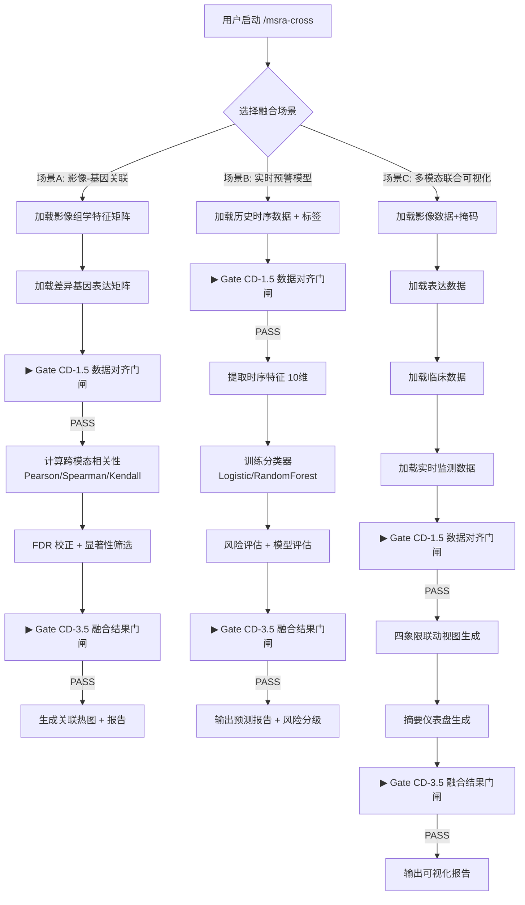

# PRD: MSRA Cross-Domain（跨领域融合）模块 + v1.0.0 发布

> **版本**: v1.0 | **日期**: 2026-06-25 | **状态**: 待评审
> **负责**: MSRA Team | **目标**: cross_domain Alpha → Beta + 四模块 Beta → Stable (v1.0.0)

---

## 1. 项目信息

- **Language**: 中文
- **Programming Language**: Python 3.9+（引擎层）+ Markdown（SKILL 定义层）
- **Project Name**: `msra_cross_domain`
- **命令入口**: `/msra-cross`
- **成熟度目标**: cross_domain: Alpha → Beta；三实验模块: Beta → Stable
- **项目版本路径**: 0.9.7 → 1.0.0

### 原始需求复述

为 MSRA v1.0.0 发布完成最后一块拼图：cross_domain 跨领域融合模块从 Alpha 提升到 Beta 成熟度（SKILL 入口 + 质量门闸 + 命令注册 + 测试覆盖），同时完成四个实验性模块的端到端验证和文档完善，推动全项目从 0.9.7 升级到 1.0.0 正式版本。cross_domain 模块的 `integration.py` 已实现 3 个核心类（`RadiomicsDEGCorrelation`、`RealtimePredictionModel`、`MultiModalVisualizer`），但缺少质量门闸、SKILL 入口、命令注册、测试用例和用户文档。

---

## 2. cross_domain 模块功能定义

### 2.1 模块定位与目标用户

| 维度 | 说明 |
|------|------|
| **模块定位** | 将 medical_imaging（影像组学）、bioinformatics（基因表达）、realtime_analytics（实时监控）三个实验性模块的分析结果进行跨模态融合分析，提供单模块无法发现的跨域关联模式 |
| **目标用户** | 多模态数据融合研究者、转化医学研究者、精准医学研究团队 |
| **核心价值** | 在统一工作流中完成影像-基因关联、实时预警建模、多模态联合可视化，无需在多个工具间手动切换 |
| **依赖关系** | 依赖前三个模块的输出产物（特征矩阵、表达矩阵、时序指标），可独立调用也可联动使用 |

### 2.2 用户故事

| # | 用户故事 | 优先级 |
|---|---------|--------|
| US-1 | 作为**多模态数据融合研究者**，我想通过 `/msra-cross` 加载影像组学特征矩阵和差异基因表达矩阵，自动计算跨模态关联并生成热图，以便发现影像表型与分子特征的对应关系 | P0 |
| US-2 | 作为**临床研究者**，我想基于患者生命体征时序数据训练实时预警模型，获取风险分级和预测概率，以便在临床恶化前触发干预 | P0 |
| US-3 | 作为**转化医学研究者**，我想在一张联动视图中同时查看影像切片、基因表达热图、临床指标箱线图和实时监测曲线，以便直观比较多维度数据的关联 | P0 |
| US-4 | 作为**数据科学家**，我想在跨模态融合前自动校验样本对齐和模态完整性，以便避免因数据不匹配导致的虚假关联 | P0 |
| US-5 | 作为**项目负责人**，我想将跨模态融合结果导出为标准化 Schema，以便接入主 Pipeline 的 Stage 3 进行联合建模 | P1 |
| US-6 | 作为**研究者**，我想使用 MOFA/iCluster 风格的多组学因子分析进行更深入的数据融合，以便发现潜在驱动因子 | P2 |

#### 用户故事流程图



### 2.3 需求池

#### P0 — 必须完成（Beta 准入 + v1.0.0 发布阻断）

| ID | 需求 | 描述 | 交付物 |
|----|------|------|--------|
| P0-1 | **SKILL.md 创建** | `skills/cross-domain/SKILL.md`，定义 Phase 0-4 完整流程、角色、Iron Rules、质量门闸引用 | SKILL.md 文件 |
| P0-2 | **命令注册** | `manifest.json` 中新增 `/msra-cross` 命令，指向 `skills/cross-domain/SKILL.md` | manifest.json 更新 |
| P0-3 | **Gate CD-1.5 实现** | 数据对齐门闸：样本对齐 🔑、模态完整性 🔑、数据类型匹配。复用 `shared/quality_gates/GateRunner` | `msra_modules/cross_domain/quality_gates.py` |
| P0-4 | **Gate CD-3.5 实现** | 融合结果门闸：关联显著性 🔑、模型性能 🔑、可视化一致性。复用 `shared/quality_gates/GateRunner` | 同上文件 |
| P0-5 | **单元测试** | 为 `RadiomicsDEGCorrelation`、`RealtimePredictionModel`、`MultiModalVisualizer` 各编写 ≥ 5 个测试用例；为 Gate CD-1.5/3.5 各编写 ≥ 3 个测试用例。覆盖率 ≥ 50% | `tests/test_cross_domain/` |
| P0-6 | **__init__.py 更新** | 新增导出 `CrossDomainQualityGateChecker`，版本号确认或更新 | `msra_modules/cross_domain/__init__.py` |
| P0-7 | **SKILL.md Phase 定义** | Phase 0（交互配置）→ Phase 1（数据对齐 + Gate CD-1.5）→ Phase 2（后台融合分析）→ Phase 3（结果审查 + Gate CD-3.5）→ Phase 4（整合/报告） | SKILL.md 内容 |

#### P1 — 应该完成

| ID | 需求 | 描述 | 交付物 |
|----|------|------|--------|
| P1-1 | **端到端融合工作流编排** | SKILL.md Phase 2 中定义子 Agent 任务，串联影像→基因→实时数据的融合分析 | SKILL.md Phase 2 + Agent 任务描述 |
| P1-2 | **数据对齐策略** | 实现多种对齐策略：inner join（严格匹配）、outer join（允许缺失+插补）、time-based（时序数据按时间窗对齐） | `integration.py` 新增 `DataAligner` 类 |
| P1-3 | **Schema 导出** | 定义并实现 `msra/cross_domain_result/v1` Schema 输出 | 导出逻辑 + Schema 文档 |
| P1-4 | **集成测试** | 端到端测试：模拟影像特征 + 模拟表达数据 → 关联分析 → 报告生成 | `tests/test_cross_domain/test_integration.py` |
| P1-5 | **依赖管理** | `pyproject.toml` 中 `[project.optional-dependencies]` 新增 `cross_domain` extras | pyproject.toml 更新 |
| P1-6 | **文档更新** | 更新 `docs/dev/18-实验性模块设计.md` 中 cross_domain 状态为 Beta | 文档更新 |

#### P2 — 可以完成

| ID | 需求 | 描述 |
|----|------|------|
| P2-1 | **MOFA 风格多组学因子分析** | 实现多组学因子分析，发现跨模态潜在驱动因子 |
| P2-2 | **iCluster 风格联合聚类** | 基于贝叶斯框架的多模态联合聚类分析 |
| P2-3 | **交互式可视化** | 基于 Plotly 的交互式联动视图，支持点击联动、刷选高亮 |
| P2-4 | **SHAP 跨模态可解释性** | 对融合预测模型进行 SHAP 特征重要性分析 |
| P2-5 | **多核学习（MKL）** | 对不同模态特征使用不同核函数的多核学习融合策略 |

### 2.4 质量门闸设计

#### Gate CD-1.5（数据对齐门闸）— 位于 Phase 1 之后

| # | 检查项 | 关键 | 检查方法 | 通过标准 |
|---|--------|------|---------|---------|
| 1 | 样本对齐 | 🔑 | 检查各模态数据的样本 ID 交集是否 ≥ 最小样本数 | 交集样本数 ≥ 3（关联分析）/ ≥ 10（预测模型） |
| 2 | 模态完整性 | 🔑 | 检查所选场景所需的模态数据是否全部提供 | 场景A需影像+表达；场景B需时序+标签；场景C需 ≥ 1 个模态 |
| 3 | 数据类型匹配 | | 检查各模态数据的 DataFrame/Array 维度和 dtype 是否符合预期 | radiomics: DataFrame(sample×feature)；expression: DataFrame(sample×gene)；realtime: Dict[str, List] |

```python
class CrossDomainQualityGateChecker:
    """跨领域融合质量门闸检查器

    封装 Gate CD-1.5 和 Gate CD-3.5 的具体检查逻辑，
    产出 CheckItemResult 列表供 GateRunner 消费。

    Usage:
        checker = CrossDomainQualityGateChecker(study_id="CD-2026-001")

        # Gate CD-1.5: 数据对齐检查
        gate_result = checker.run_gate_cd15(
            data_sources={"radiomics": df_features, "expression": df_expr},
            min_samples=3,
        )

        # Gate CD-3.5: 融合结果检查
        gate_result = checker.run_gate_cd35(
            correlation_results=corr_dict,
            model_metrics=metrics_dict,
            visualization_data=viz_dict,
        )
    """

    def __init__(self, study_id: str, project_root: Optional[str] = None):
        self.study_id = study_id
        self._runner = GateRunner(study_id=study_id, project_root=project_root)

    def run_gate_cd15(
        self,
        data_sources: Dict[str, Any],
        min_samples: int = 3,
        scenario: str = "correlation",
    ) -> GateResult:
        """执行 Gate CD-1.5 全部 3 项检查"""
        ...

    def run_gate_cd35(
        self,
        correlation_results: Optional[Dict] = None,
        model_metrics: Optional[Dict] = None,
        visualization_data: Optional[Dict] = None,
    ) -> GateResult:
        """执行 Gate CD-3.5 全部 3 项检查"""
        ...
```

#### Gate CD-3.5（融合结果门闸）— 位于 Phase 3 之前

| # | 检查项 | 关键 | 检查方法 | 通过标准 |
|---|--------|------|---------|---------|
| 1 | 关联显著性 | 🔑 | 检查关联分析中 FDR 校正后的 p 值是否有显著结果；或预测模型的 AUROC 是否优于随机 | 关联: 至少 1 对显著 (p_adj < 0.05 & \|r\| ≥ 0.3)；预测: AUROC > 0.5 |
| 2 | 模型性能 | 🔑 | 检查预测模型的准确率、精确率、召回率、F1、AUROC 是否在合理范围 | 准确率 ≥ 0.5；AUROC ≥ 0.55；无 NaN 指标 |
| 3 | 可视化一致性 | | 检查可视化数据与原始数据的一致性（热图矩阵维度、曲线点数等） | 可视化数据维度与输入数据匹配 |

### 2.5 SKILL.md Phase 定义

#### Phase 0: 用户交互配置（MANDATORY）

```
┌─────────────────────────────────────────────────────────────┐
│  /msra-cross 启动                                            │
│                                                              │
│  1. 融合场景选择:                                            │
│     ├─ [A] 影像组学-基因表达关联分析 (Radiomics × DEG)       │
│     ├─ [B] 实时预警模型 (时序 → 风险预测)                   │
│     ├─ [C] 多模态联合可视化 (影像+表达+临床+实时)           │
│     └─ [D] 完整融合流程 (A+B+C)                             │
│                                                              │
│  2. 数据源指定:                                              │
│     ├─ 影像特征矩阵: CSV (sample × feature)                 │
│     ├─ 基因表达矩阵: CSV (sample × gene)                    │
│     ├─ 临床数据: CSV (sample × variables)                   │
│     ├─ 实时数据: CSV/Dict (metric → values)                 │
│     └─ 或: 引用其他模块输出 (MSRA/reports/...)              │
│                                                              │
│  3. 参数配置 (可选覆盖默认值):                                │
│     ├─ 关联方法: pearson | spearman | kendall               │
│     ├─ FDR 校正: bh | bonferroni                            │
│     ├─ 显著性阈值: p_adj < 0.05, |r| >= 0.3                 │
│     ├─ 预测模型: logistic | random_forest                   │
│     ├─ 窗口大小/预测时窗: 秒                                │
│     └─ 可视化: figsize, dpi, top_n                          │
└─────────────────────────────────────────────────────────────┘
```

#### Phase 1: 数据对齐与质控（ADAPTIVE）

```
┌─────────────────────────────────────────────────────────────┐
│  Phase 1: 数据加载与对齐                                     │
│                                                              │
│  Step 1.1: 多模态数据加载                                    │
│    → 按场景加载所需模态数据                                  │
│    → 输出: 各模态数据统计摘要                                │
│                                                              │
│  Step 1.2: ▶ Gate CD-1.5 数据对齐门闸                       │
│    → [🔑] 样本对齐 (交集样本数 ≥ 阈值)                      │
│    → [🔑] 模态完整性 (所需模态全部提供)                     │
│    → [ ] 数据类型匹配 (维度/dtype 符合预期)                  │
│    → ❌ 关键项不通过 → 阻断并提示缺失模态/样本               │
│                                                              │
│  Step 1.3: 数据预处理 (自动)                                 │
│    → 样本对齐 (取交集或并集+插补)                            │
│    → 缺失值处理                                              │
│    → 标准化 (z-score / min-max)                              │
└─────────────────────────────────────────────────────────────┘
```

#### Phase 2: 融合分析（BACKGROUND — 子 Agent 执行）

```
┌─────────────────────────────────────────────────────────────┐
│  Phase 2: 后台融合分析 (子 Agent 并行执行)                   │
│                                                              │
│  ┌─ Task A: 影像-基因关联分析 ──────────────────────┐       │
│  │  RadiomicsDEGCorrelation.correlate()              │       │
│  │  → Pearson/Spearman/Kendall + FDR 校正            │       │
│  │  → generate_heatmap_data()                        │       │
│  │  输出: 关联矩阵 + 显著性表                         │       │
│  └────────────────────────────────────────────────────┘       │
│                                                              │
│  ┌─ Task B: 实时预警模型 ───────────────────────────┐       │
│  │  RealtimePredictionModel.train()                  │       │
│  │  → 时序特征提取 (10维统计+趋势特征)               │       │
│  │  → Logistic/RF 分类器训练                         │       │
│  │  → evaluate() 评估指标                            │       │
│  │  输出: 模型 + 评估报告 + 风险分级                  │       │
│  └────────────────────────────────────────────────────┘       │
│                                                              │
│  ┌─ Task C: 多模态联合可视化 ───────────────────────┐       │
│  │  MultiModalVisualizer.create_linked_view()        │       │
│  │  → 四象限联动视图 (影像+表达+临床+实时)           │       │
│  │  → create_summary_dashboard()                     │       │
│  │  输出: 联动视图 PNG + 摘要仪表盘                   │       │
│  └────────────────────────────────────────────────────┘       │
└─────────────────────────────────────────────────────────────┘
```

#### Phase 3: 结果审查（MANDATORY）

```
┌─────────────────────────────────────────────────────────────┐
│  Phase 3: 结果审查 + Gate CD-3.5                            │
│                                                              │
│  Step 3.1: ▶ Gate CD-3.5 融合结果门闸                       │
│    → [🔑] 关联显著性 (FDR 校正后有显著结果)                  │
│    → [🔑] 模型性能 (AUROC/准确率优于随机)                    │
│    → [ ] 可视化一致性 (数据维度匹配)                         │
│                                                              │
│  Step 3.2: 结果展示                                          │
│    → 关联热图 (Top-N 特征-基因对)                            │
│    → 模型评估指标表 (准确率/精确率/召回率/F1/AUROC)          │
│    → 风险分级分布                                            │
│    → 多模态联动视图                                          │
│                                                              │
│  Step 3.3: 用户确认                                          │
│    → 展示结果摘要 + 关键发现                                  │
│    → 用户确认 / 请求调整参数重跑                              │
└─────────────────────────────────────────────────────────────┘
```

#### Phase 4: 整合与报告（ADAPTIVE）

```
┌─────────────────────────────────────────────────────────────┐
│  Phase 4: 结果整合                                           │
│                                                              │
│  选项 A: 独立报告                                            │
│    → 生成 cross_domain_report.md                             │
│    → 导出关联结果 CSV                                        │
│    → 导出模型评估 JSON                                       │
│    → 导出可视化包 (PNG/SVG)                                  │
│                                                              │
│  选项 B: 接入主 Pipeline                                     │
│    → 融合特征矩阵 → MSRA/data/cross_domain_features.csv     │
│    → 自动触发 /msra-exec 将其作为预测变量纳入 Stage 3        │
│                                                              │
│  输出 Schema: msra/cross_domain_result/v1                    │
│    ├─ correlation_results.csv                                │
│    ├─ model_metrics.json                                     │
│    ├─ visualization_bundle/ (png/svg)                        │
│    └─ cross_domain_report.md                                 │
└─────────────────────────────────────────────────────────────┘
```

### 2.6 manifest.json 命令注册

```json
"/msra-cross": {
  "id": "msra-cross",
  "name": "Cross-Domain Analysis",
  "entry_point": "skills/cross-domain/SKILL.md",
  "description": "Cross-domain multi-modal fusion: radiomics-DEG correlation, realtime prediction model, multi-modal linked visualization. Integrates imaging, bioinformatics, and realtime analytics.",
  "usage": "/msra-cross [--scenario correlation|prediction|visualization|full] [--radiomics features.csv] [--expression deg.csv] [--clinical clinical.csv] [--realtime vitals.csv]",
  "examples": [
    "/msra-cross --scenario correlation --radiomics features.csv --expression deg.csv",
    "/msra-cross --scenario prediction --realtime vitals.csv --labels labels.csv",
    "/msra-cross --scenario visualization --radiomics features.csv --expression deg.csv --clinical clinical.csv --realtime vitals.csv"
  ]
}
```

### 2.7 Python 引擎新增/补全清单

| 文件 | 状态 | 新增类/函数 | 说明 |
|------|------|------------|------|
| `quality_gates.py` | 🆕 新建 | `CrossDomainQualityGateChecker` | Gate CD-1.5 + Gate CD-3.5 实现，复用 `shared/quality_gates/GateRunner` |
| `integration.py` | 📝 补全 | `DataAligner`（P1） | 多策略数据对齐：inner/outer/time-based |
| `integration.py` | 📝 补全 | `export_v1_schema()` | `msra/cross_domain_result/v1` Schema 导出 |
| `__init__.py` | 📝 更新 | 新增导出 `CrossDomainQualityGateChecker` | 版本号确认为 1.0.0 |
| `tests/test_cross_domain/` | 🆕 新建 | 测试文件 | 每个类 ≥ 5 个测试用例 + 门闸测试 |

---

## 3. 端到端验证范围

### 3.1 验证矩阵

端到端验证覆盖**单模块**和**跨模块融合**两个层级，使用模拟数据（可复现）验证完整流程。

#### 3.1.1 单模块端到端验证

| # | 模块 | 验证场景 | 数据来源 | 入口命令 | 通过标准 |
|---|------|---------|---------|---------|---------|
| E2E-BIO-01 | bioinformatics | 差异表达分析全流程 | 模拟 count matrix (50 样本 × 2000 基因) | `/msra-bio --data mock_counts.csv` | 生成 DE 表 + 火山图，Gate Bio-1.5/3.5 PASS |
| E2E-BIO-02 | bioinformatics | 通路富集分析 | E2E-BIO-01 的 DE 基因列表 | `/msra-bio --mode enrichment` | 生成富集表，至少 1 条通路 FDR < 0.05 |
| E2E-IMG-01 | medical_imaging | 放射组学特征提取 | 模拟 NIfTI 影像 + 掩码 | `/msra-imaging --nifti mock.nii.gz --roi mock_mask.nii.gz` | 生成特征矩阵 CSV，Gate IMG-1 PASS |
| E2E-IMG-02 | medical_imaging | 特征选择 | E2E-IMG-01 的特征矩阵 | `/msra-imaging --mode feature_selection` | 特征数减少 ≥ 30%，无 NaN |
| E2E-RT-01 | realtime_analytics | 实时监控模拟全流程 | VitalSignsSimulator 60s | `/msra-rt --source simulator --duration 60` | 生成监控报告，Gate RT-1 PASS |
| E2E-RT-02 | realtime_analytics | 异常检测 + 告警 | 注入异常的模拟数据 | `/msra-rt --source simulator --duration 120` | 检测到注入异常，触发告警 |

#### 3.1.2 跨模块融合端到端验证

| # | 场景 | 输入数据 | 入口命令 | 通过标准 |
|---|------|---------|---------|---------|
| E2E-CD-01 | 影像-基因关联 | E2E-IMG-01 特征矩阵 + E2E-BIO-01 表达矩阵 | `/msra-cross --scenario correlation` | 关联矩阵生成，Gate CD-1.5/3.5 PASS |
| E2E-CD-02 | 实时预警模型 | E2E-RT-01 时序数据 + 模拟标签 | `/msra-cross --scenario prediction` | 模型训练成功，AUROC ≥ 0.55 |
| E2E-CD-03 | 多模态联合可视化 | E2E-IMG-01 + E2E-BIO-01 + 模拟临床 + E2E-RT-01 | `/msra-cross --scenario visualization` | 四象限联动视图生成 |
| E2E-CD-04 | 完整融合流程 | 全部上述数据 | `/msra-cross --scenario full` | 三场景结果全部生成 + 报告输出 |

### 3.2 验证脚本存放位置

```
tests/
├── e2e/                                    # 🆕 端到端验证目录
│   ├── __init__.py
│   ├── conftest.py                         # E2E 公共 fixture（模拟数据生成器）
│   ├── test_e2e_bioinformatics.py          # E2E-BIO-01, E2E-BIO-02
│   ├── test_e2e_medical_imaging.py         # E2E-IMG-01, E2E-IMG-02
│   ├── test_e2e_realtime_analytics.py      # E2E-RT-01, E2E-RT-02
│   ├── test_e2e_cross_domain.py            # E2E-CD-01 ~ E2E-CD-04
│   └── fixtures/                           # 模拟数据生成脚本
│       ├── generate_mock_counts.py         # 模拟 count matrix
│       ├── generate_mock_nifti.py          # 模拟 NIfTI 影像 + 掩码
│       ├── generate_mock_vitals.py         # 模拟生命体征时序
│       ├── generate_mock_clinical.py       # 模拟临床数据
│       └── generate_mock_labels.py         # 模拟标签
```

### 3.3 通过标准

| 检查维度 | 标准 |
|---------|------|
| **流程完整性** | 每个验证场景从入口命令到最终报告生成无中断 |
| **质量门闸** | 所有 Gate（Bio-1.5/3.5、IMG-1、RT-1、CD-1.5/3.5）均返回 PASS 或 CONDITIONAL |
| **产物完整性** | 输出 Schema 中定义的所有 required_fields 文件均生成且非空 |
| **数值合理性** | 关联分析 |r| ≤ 1.0；p 值 ∈ [0, 1]；AUROC ∈ [0, 1]；预测概率 ∈ [0, 1] |
| **可复现性** | 固定随机种子后，相同输入产生相同输出 |
| **跨模块兼容** | 单模块输出可直接作为 cross_domain 输入，无需手动格式转换 |

### 3.4 验证执行方式

```bash
# 运行全部 E2E 测试
pytest tests/e2e/ -v --tb=short -m "integration"

# 单独运行跨模块融合 E2E
pytest tests/e2e/test_e2e_cross_domain.py -v

# 运行单个模块 E2E
pytest tests/e2e/test_e2e_bioinformatics.py -v
```

---

## 4. v1.0.0 发布清单

### 4.1 版本号升级路径

| 文件 | 当前版本 | 目标版本 | 说明 |
|------|---------|---------|------|
| `manifest.json` | `"version": "0.9.7"` | `"version": "1.0.0"` | 插件主版本号 |
| `pyproject.toml` | `version = "0.9.7"` | `version = "1.0.0"` | Python 包版本号 |
| `README.md` | 描述中"12个命令" | "13个命令" | 新增 `/msra-cross` |
| `msra_modules/cross_domain/__init__.py` | `__version__ = "1.0.0"` | 确认为 `"1.0.0"` | 模块版本号（已是 1.0.0） |
| `msra_modules/bioinformatics/__init__.py` | `1.1.0` | `1.1.0` (Stable 标记) | 版本不变，状态标记变更 |
| `msra_modules/medical_imaging/__init__.py` | `1.2.0` | `1.2.0` (Stable 标记) | 版本不变，状态标记变更 |
| `msra_modules/realtime_analytics/__init__.py` | `1.2.0` | `1.2.0` (Stable 标记) | 版本不变，状态标记变更 |

### 4.2 manifest.json 变更

- 新增 `/msra-cross` 命令条目（见 §2.6）
- `"version"` 从 `"0.9.7"` 更新为 `"1.0.0"`
- `/msra-modules` 命令 description 更新：增加 cross_domain 模块引用
- 命令总数从 12 → 13

### 4.3 CHANGELOG 条目要点

```markdown
## [1.0.0] - 2026-06-26

Cross-domain module Phase 4: Alpha → Beta. Three experimental modules: Beta → Stable.
First stable release of MSRA.

### Added
- **`skills/cross-domain/SKILL.md`** — Skill entry point for `/msra-cross`. Phase 0-4
  (config → data alignment+QC → background fusion → review → report).
  3 scenarios: radiomics-DEG correlation, realtime prediction, multi-modal visualization.
- **`msra_modules/cross_domain/quality_gates.py`** — `CrossDomainQualityGateChecker`:
  Gate CD-1.5 (3 items: sample alignment 🔑, modality completeness 🔑, data type match)
  + Gate CD-3.5 (3 items: correlation significance 🔑, model performance 🔑, visualization consistency).
  Reuses `shared/quality_gates/GateRunner`.
- **`manifest.json`** — Registered `/msra-cross` command. Version bumped to 1.0.0.
- **`pyproject.toml`** — Added `cross_domain` optional dependency group.
- **`tests/test_cross_domain/`** — N test cases (all passed):
  - test_radiomics_deg_correlation.py
  - test_realtime_prediction_model.py
  - test_multi_modal_visualizer.py
  - test_quality_gates.py
  - test_integration.py
- **`tests/e2e/`** — End-to-end verification suite (10 scenarios across 4 modules).
- **`docs/user_guide/`** — User tutorials for all 4 experimental modules.
- **`docs/api/`** — API reference for all 4 experimental modules.

### Changed
- **Version**: 0.9.7 → 1.0.0 (first stable release)
- **`docs/dev/18-实验性模块设计.md`** — cross_domain status: Alpha → Beta;
  all modules status: Beta → Stable
- **`README.md`** — Updated command count (12→13), added cross_domain section,
  updated module maturity table
- **Module maturity**: bioinformatics, medical_imaging, realtime_analytics → 🟢 Stable

### Test Results
- cross_domain: N tests (N passed, 0 failed)
- E2E suite: 10 scenarios (10 passed, 0 failed)
```

### 4.4 README 需补充的内容

| 章节 | 变更内容 |
|------|---------|
| **顶部描述** | "12 个命令" → "13 个命令" |
| **命令一览** | 实验性模块分区从"1个"改为"5个"，新增 `/msra-cross` 命令行 |
| **项目结构** | `skills/` 新增 `cross-domain/` 目录；`tests/` 新增 `e2e/` 目录；`docs/` 新增 `user_guide/` 和 `api/` 目录 |
| **模块成熟度表** | 新增 cross_domain 模块行；全部标记为 🟢 Stable |
| **快速开始** | 新增 `/msra-cross` 使用示例 |
| **实验性模块** 章节 | 新增 cross_domain 使用说明和示例 |

### 4.5 三模块 Beta → Stable 判定标准

依据 `docs/dev/18-实验性模块设计.md` §18.8.3 的 Beta → Stable 准入条件：

| 准入条件 | bioinformatics | medical_imaging | realtime_analytics | 验证方式 |
|---------|---------------|-----------------|-------------------|---------|
| 测试覆盖率 ≥ 80% | 62 测试 (39 pass / 23 skip) | 60 测试 (46 pass / 14 skip) | 102 测试 (102 pass) | `pytest --cov=msra_modules.<module>` |
| 用户文档完整（教程 + API 参考） | 📝 需补充 | 📝 需补充 | 📝 需补充 | `docs/user_guide/` + `docs/api/` |
| 无已知 P0/P1 级缺陷 | ✅ | ✅ | ✅ | QA 验证记录 |
| 与主 Pipeline 集成测试通过 | ✅ 差异基因→Stage 3 | ✅ 特征→Stage 3 | ✅ 独立运行 | E2E 测试 |
| 性能基准测试完成 | 📝 需补充 | 📝 需补充 | 📝 需补充 | benchmark 脚本 |

> **注意**: bioinformatics 和 medical_imaging 有部分测试因可选依赖未安装而 skip。Beta → Stable 升级时需安装全部依赖并确保 skip 数为 0，或在文档中明确说明可选依赖的安装方式。

### 4.6 pyproject.toml 依赖组更新

```toml
[project.optional-dependencies]
# ... 已有的 dev, docs, bioinformatics, medical_imaging, realtime_analytics ...

cross_domain = [
    "scipy>=1.10",
    "scikit-learn>=1.3",
    "matplotlib>=3.7",
]

# 更新 experimental 组以包含 cross_domain
experimental = [
    "medical-stats-research-assistant[medical_imaging,bioinformatics,realtime_analytics,cross_domain]",
]

# 新增完整安装组
all = [
    "medical-stats-research-assistant[experimental,dev]",
]
```

> **说明**: `cross_domain` 依赖的 scipy/scikit-learn/matplotlib 均已在核心依赖中，此 extras 组主要用于语义化标记和未来扩展（如 MOFA、iCluster 等高级融合算法的额外依赖）。

---

## 5. 文档完善清单

### 5.1 用户教程清单（`docs/user_guide/`）

新建 `docs/user_guide/` 目录，为四个实验性模块各编写一份用户教程。

| # | 文件路径 | 内容大纲 | 参考风格 |
|---|---------|---------|---------|
| UG-1 | `docs/user_guide/bioinformatics-tutorial.md` | 1. 模块简介与适用场景<br/>2. 安装依赖 (`pip install ...[bioinformatics]`)<br/>3. 数据准备（10x MTX / CSV / H5）<br/>4. 完整分析流程演示<br/>5. 差异表达分析 + 火山图解读<br/>6. 通路富集分析<br/>7. 质量门闸说明<br/>8. 与主 Pipeline 集成<br/>9. 常见问题 FAQ | `docs/prd/bioinformatics-module-prd.md` |
| UG-2 | `docs/user_guide/medical-imaging-tutorial.md` | 1. 模块简介与适用场景<br/>2. 安装依赖<br/>3. 数据准备（DICOM / NIfTI / NRRD）<br/>4. 影像加载与预处理<br/>5. 放射组学特征提取<br/>6. 特征选择方法对比<br/>7. 质量门闸说明<br/>8. 与主 Pipeline 集成<br/>9. FAQ | `docs/prd/` + `docs/dev/18-实验性模块设计.md` |
| UG-3 | `docs/user_guide/realtime-analytics-tutorial.md` | 1. 模块简介与适用场景<br/>2. 安装依赖<br/>3. 数据源配置（模拟器 / Redis / CSV）<br/>4. 实时监控全流程<br/>5. 异常检测配置（规则引擎 / Isolation Forest）<br/>6. 告警规则定制<br/>7. 质量门闸说明<br/>8. 报告导出<br/>9. FAQ | `docs/prd/msra_rt_prd.md` |
| UG-4 | `docs/user_guide/cross-domain-tutorial.md` | 1. 模块简介与适用场景<br/>2. 安装依赖<br/>3. 前置条件（其他模块输出）<br/>4. 场景A: 影像-基因关联分析<br/>5. 场景B: 实时预警模型<br/>6. 场景C: 多模态联合可视化<br/>7. 质量门闸说明<br/>8. 完整融合流程演示<br/>9. 与主 Pipeline 集成<br/>10. FAQ | 本 PRD |

### 5.2 API 参考文档清单（`docs/api/`）

新建 `docs/api/` 目录，为四个实验性模块各编写一份 API 参考文档。

| # | 文件路径 | 内容大纲 |
|---|---------|---------|
| API-1 | `docs/api/bioinformatics-api.md` | 所有公开类/函数签名、参数说明、返回值、示例代码。覆盖: `ScRNASeqLoader`, `SingleCellQC`, `DimensionalityReduction`, `DifferentialExpression`, `PathwayEnrichment`, `BatchCorrector`, `BioQualityGateChecker` |
| API-2 | `docs/api/medical-imaging-api.md` | 覆盖: `load_dicom_series`, `load_nifti`, `load_nrrd`, `preprocess_image`, `Segmentation`, `Registration`, `extract_radiomics_features`, `FeatureSelector`, `ImagingQualityGateChecker` |
| API-3 | `docs/api/realtime-analytics-api.md` | 覆盖: `StreamProcessor`, `AnomalyDetector`, `DetectionResult`, `MultivariateDetector`, `AlertSystem`, `Alert`, `RealtimeDashboard`, `VitalSignsSimulator`, `RealtimeQualityGateChecker` |
| API-4 | `docs/api/cross-domain-api.md` | 覆盖: `RadiomicsDEGCorrelation`, `RealtimePredictionModel`, `MultiModalVisualizer`, `CrossDomainQualityGateChecker`, `DataAligner` (P1) |

### 5.3 格式要求

- 参考 `docs/prd/` 已有 PRD 的 Markdown 风格（表格 + 代码块 + 分层标题）
- 参考 `docs/dev/18-实验性模块设计.md` 的组件表格风格
- 用户教程使用中文，代码示例使用 Python/Shell
- API 参考使用中英双语（类名/方法名英文，说明中文）
- 每份文档头部包含版本、日期、状态元信息

### 5.4 其他文档更新清单

| # | 文件 | 更新内容 |
|---|------|---------|
| D-1 | `docs/dev/18-实验性模块设计.md` | cross_domain 状态: 🔴 Alpha → 🟡 Beta；三模块状态: 🟡 Beta → 🟢 Stable；新增 Gate CD-1.5/3.5 定义；更新 §18.8.2 状态表 |
| D-2 | `docs/dev/MSRA开发进度表.md` | 新增 cross_domain 模块开发进度条目 |
| D-3 | `README.md` | 见 §4.4 |
| D-4 | `CHANGELOG.md` | 见 §4.3 |
| D-5 | `manifest.json` | 见 §4.2 |
| D-6 | `pyproject.toml` | 见 §4.6 |

---

## 6. 待确认问题（Open Questions）

| # | 问题 | 影响范围 | 建议默认 |
|---|------|---------|---------|
| Q1 | cross_domain 模块的子 Agent 调度是复用现有 `HybridModeBridge` 还是新建专用调度器？ | P0-1, P0-7, P1-1 | **建议复用 HybridModeBridge**，新增 `CROSS_DOMAIN_ANALYSIS` 子类型，与 bio/imaging/rt 模块保持一致 |
| Q2 | Gate CD-1.5 中"样本对齐"的最低样本数阈值：关联分析 3 个是否太少？是否应设为 5 或 10？ | P0-3 | **关联分析默认 3**（与现有 `RadiomicsDEGCorrelation` 一致），预测模型默认 10，用户可在 Phase 0 覆盖 |
| Q3 | 数据对齐策略（P1-2 `DataAligner`）：inner join 会导致样本数锐减，是否默认 outer join + 插补？ | P1-2 | **默认 inner join**（严格匹配，避免插补引入偏差），outer join 作为可选项由用户显式指定 |
| Q4 | `msra/cross_domain_result/v1` Schema 的具体字段定义需要与 `shared/contracts/` 中已有 Schema 格式一致，是否需要新建 contracts 文件？ | P1-3 | **建议新建** `shared/contracts/cross_domain_result_schema.md`，参照 `msra/imaging_features/v1` 格式 |
| Q5 | bioinformatics/medical_imaging 模块的 skip 测试（因可选依赖未安装）：v1.0.0 发布时是否要求全部安装并 0 skip？ | §4.5 Stable 判定 | **建议 v1.0.0 发布时安装全部可选依赖并确保 0 skip**，CI 中增加 `pip install ...[experimental]` 步骤 |
| Q6 | cross_domain 模块是否需要独立的 SKILL.md frontmatter 定义（如 `layer: functional`）？ | P0-1 | **建议与其他实验性模块一致**：`layer: functional`, `depends_on: [pipeline]`, `optional_dependencies: [msra_modules.cross_domain]` |
| Q7 | E2E 测试中模拟数据的随机种子是否固定？是否需要提供多种随机种子验证鲁棒性？ | §3.3, §3.4 | **固定随机种子 (seed=42)** 确保可复现；CI 中可额外运行 seed=123 验证鲁棒性 |
| Q8 | v1.0.0 发布是否同时发布 GitHub Release + Tag？是否需要 release notes？ | §4.3 | **建议同步发布** GitHub Release v1.0.0 + Git tag，release notes 从 CHANGELOG 提取 |
| Q9 | 用户教程和 API 参考文档是否需要英文版本？ | §5 | **v1.0.0 仅发布中文版**，英文版作为 v1.1 规划；API 参考中的类名/方法名保持英文 |
| Q10 | `/msra-cross` 命令是否需要更新 `/msra-modules` 管理命令的 list/info/check 子命令以支持 cross_domain？ | P0-2 | **建议同步更新** `commands/msra-modules.md`，使 `list` 显示 cross_domain，`info cross_domain` 可查看详情 |

---

## 7. 依赖清单

### 7.1 cross_domain 模块运行时依赖

```python
# 核心依赖（已在项目核心依赖中）
numpy >= 1.24
pandas >= 1.5
scipy >= 1.10           # Pearson/Spearman/Kendall 相关
scikit-learn >= 1.3     # LogisticRegression / RandomForestClassifier
matplotlib >= 3.7       # 多模态可视化

# 无额外依赖 — cross_domain 复用核心依赖 + 前三模块的可选依赖
```

### 7.2 前置模块依赖

cross_domain 的完整功能依赖前三个实验性模块：

| 场景 | 依赖模块 | 依赖产物 |
|------|---------|---------|
| 场景A: 影像-基因关联 | medical_imaging + bioinformatics | 特征矩阵 CSV + 表达矩阵 CSV |
| 场景B: 实时预警 | realtime_analytics | 时序数据 + 标签 |
| 场景C: 多模态可视化 | 全部三个模块 | 影像 + 表达 + 临床 + 实时数据 |

### 7.3 开发/测试依赖

```python
# 已有
pytest >= 7.0
pytest-cov >= 4.0

# E2E 测试可能需要
pytest-timeout >= 2.0   # E2E 超时控制
```

---

## 8. 成功标准（Alpha → Beta 准入 + v1.0.0 发布）

| 准入条件 | 验证方式 |
|---------|---------|
| ✅ SKILL.md 完成（Phase 0-4） | 文件存在且结构完整 |
| ✅ Python 引擎质量门闸实现 | `quality_gates.py` 可导入可执行 |
| ✅ 单元测试覆盖率 ≥ 50% | `pytest --cov=msra_modules.cross_domain --cov-report=term-missing` |
| ✅ 质量门闸定义完成 | Gate CD-1.5 + Gate CD-3.5 实现并有测试 |
| ✅ manifest.json 命令注册 | `/msra-cross` 命令可被 Claude Code 识别 |
| ✅ 至少 1 个端到端案例验证 | E2E-CD-01 影像-基因关联全流程跑通 |
| ✅ 版本号升级 | manifest.json + pyproject.toml → 1.0.0 |
| ✅ 文档完善 | 4 份用户教程 + 4 份 API 参考文档完成 |
| ✅ CHANGELOG 更新 | v1.0.0 条目完整 |
| ✅ README 更新 | 命令数、模块状态、项目结构更新 |

---

**文档结束**
