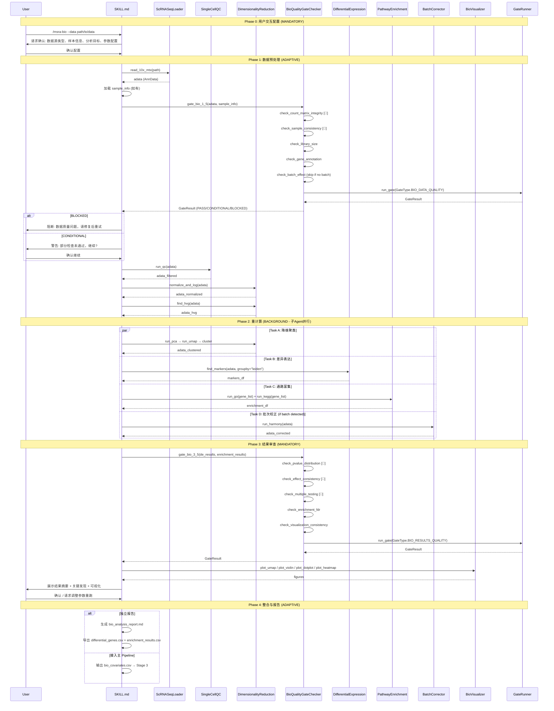
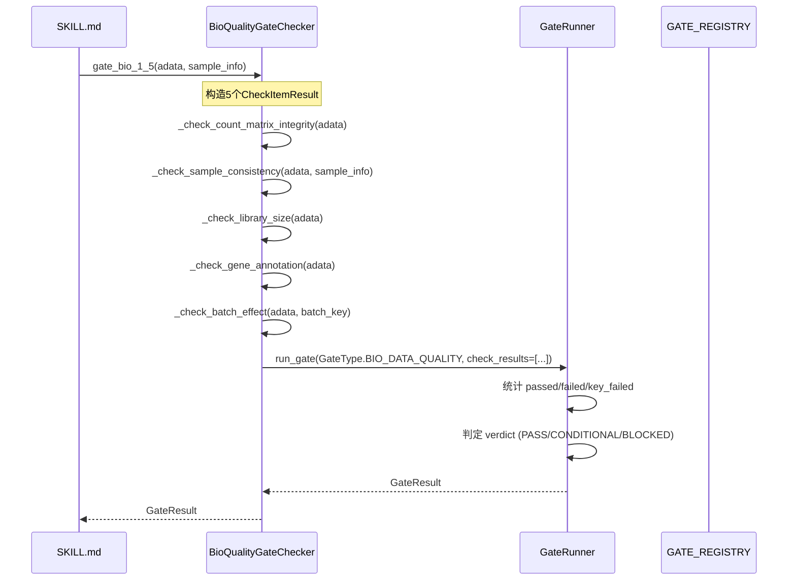
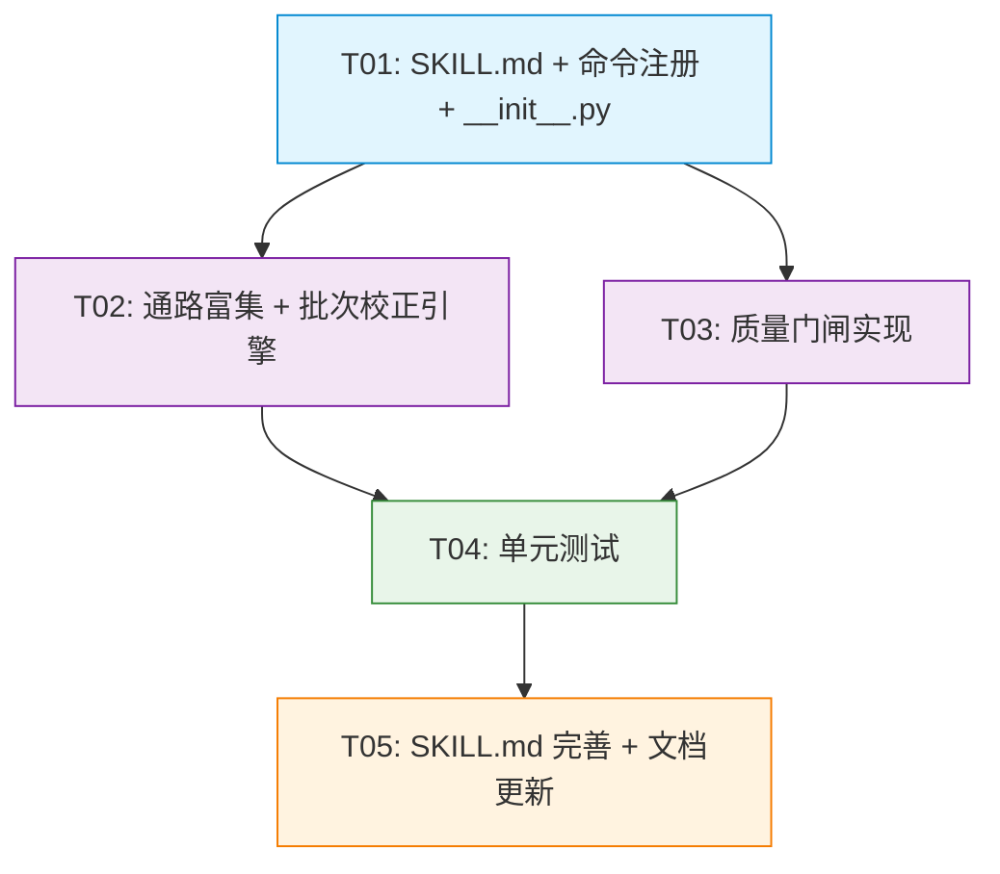

# MSRA Bioinformatics 模块 — 系统设计文档

> **版本**: v1.0 | **日期**: 2026-06-24 | **作者**: Bob (Architect)
> **PRD**: `docs/prd/bioinformatics-module-prd.md`
> **架构方案**: 方案C — Skill入口 + Agent执行

---

## Part A: 系统设计

### 1. 实现方案

#### 1.1 核心技术挑战

| 挑战 | 应对策略 |
|------|---------|
| **SKILL.md 定义完整性** | 参照 `skills/data-prep/SKILL.md` 模板，定义 Phase 0-4 的 MANDATORY/ADAPTIVE/BACKGROUND 行为模式 |
| **质量门闸与现有框架集成** | 复用 `shared/quality_gates/gate_runner.py` 的 `GateRunner` + `CheckItemCollection` 模式，新增 `BioQualityGateChecker` 封装生信特定检查逻辑 |
| **重计算子Agent调度** | 复用 `HybridModeBridge`，新增 `BIO_ANALYSIS` 子类型，Phase 2 的降维/DE/富集/批次校正以子Agent并行执行 |
| **通路富集依赖管理** | gseapy 为核心依赖，支持 GO/KEGG/GSEA 三种模式，默认人类物种(hsa)，支持物种参数切换 |
| **与主 Pipeline 集成** | 输出标准 CSV 格式的差异基因列表，放置于约定路径供 Stage 3 消费 |

#### 1.2 框架选型

| 组件 | 选择 | 理由 |
|------|------|------|
| **单细胞分析** | scanpy >= 1.9 + anndata >= 0.9 | 已有代码基于 scanpy，保持一致性 |
| **差异表达** | scanpy内置(wilcoxon) + pydeseq2 | 扫描py内置方法满足单细胞场景，pydeseq2满足bulk RNA-seq场景 |
| **通路富集** | gseapy >= 1.0 | 支持 GO/KEGG/GSEA，API简洁，Python生态首选 |
| **批次校正** | scanpy.pp.combat + scanpy.external.tl.harmony | 与scanpy生态无缝集成 |
| **质量门闸** | 复用 shared/quality_gates/ 框架 | GateRunner + CheckItemCollection 模式已成熟，避免重复造轮子 |
| **子Agent调度** | 复用 HybridModeBridge | Phase 2 BACKGROUND 模式天然适合 |
| **可视化** | matplotlib (已实现) + scanpy.pl | 保持与现有 BioVisualizer 一致 |
| **测试** | pytest + pytest-cov | 标准Python测试框架 |

#### 1.3 架构模式

采用 **Skill-Engine 分层架构**：

```
┌─────────────────────────────────────────────────────────────┐
│                    Skill Layer (Markdown)                     │
│  skills/bioinformatics/SKILL.md                              │
│  ├─ Phase 0: 用户交互配置 (MANDATORY)                        │
│  ├─ Phase 1: 数据加载→Gate Bio-1.5→QC→标准化 (ADAPTIVE)     │
│  ├─ Phase 2: 重计算子Agent (BACKGROUND)                      │
│  ├─ Phase 3: Gate Bio-3.5→可视化→用户确认 (MANDATORY)        │
│  └─ Phase 4: 独立报告/接入Pipeline (ADAPTIVE)                │
├─────────────────────────────────────────────────────────────┤
│                    Engine Layer (Python)                      │
│  msra_modules/bioinformatics/                                │
│  ├─ data_loader.py    (已有) ← 数据加载                      │
│  ├─ qc.py             (已有) ← 质量控制                      │
│  ├─ analysis.py       (已有) ← 降维/差异表达/轨迹            │
│  ├─ denoising.py      (已有) ← CellBender去噪               │
│  ├─ visualization.py  (已有) ← 可视化                        │
│  ├─ enrichment.py     (新增) ← 通路富集                      │
│  ├─ batch_correction.py (新增) ← 批次校正                    │
│  ├─ quality_gates.py  (新增) ← 质量门闸                      │
│  └─ __init__.py       (更新) ← 导出声明                      │
├─────────────────────────────────────────────────────────────┤
│                    Shared Infrastructure                      │
│  shared/quality_gates/ ← GateRunner + CheckItemCollection    │
│  manifest.json         ← 命令注册                            │
└─────────────────────────────────────────────────────────────┘
```

**设计原则**：
1. **复用优先**：复用现有 scanpy 引擎代码和 shared/quality_gates 框架，不新建抽象层
2. **渐进增强**：P0 实现核心流程，P1 增加批次校正和集成能力，P2 增加生存分析
3. **失败安全**：🔑 关键项 hard fail 阻断，非关键项 soft fail 用户确认
4. **向后兼容**：`__init__.py` 保留所有现有导出，仅追加新增类

---

### 2. 文件列表

#### 新建文件

| 相对路径 | 说明 |
|---------|------|
| `skills/bioinformatics/SKILL.md` | Skill 入口文件，定义 Phase 0-4 完整流程 |
| `msra_modules/bioinformatics/enrichment.py` | 通路富集分析引擎 |
| `msra_modules/bioinformatics/batch_correction.py` | 批次效应检测与校正引擎 |
| `msra_modules/bioinformatics/quality_gates.py` | 生信质量门闸实现 |
| `tests/test_bioinformatics/__init__.py` | 测试包初始化 |
| `tests/test_bioinformatics/test_enrichment.py` | 通路富集测试 |
| `tests/test_bioinformatics/test_batch_correction.py` | 批次校正测试 |
| `tests/test_bioinformatics/test_quality_gates.py` | 质量门闸测试 |
| `tests/test_bioinformatics/test_integration.py` | 集成测试 |

#### 修改文件

| 相对路径 | 修改内容 |
|---------|---------|
| `manifest.json` | 新增 `/msra-bio` 命令条目 |
| `msra_modules/bioinformatics/__init__.py` | 新增导出：PathwayEnrichment, BatchCorrector, BioQualityGateChecker |

---

### 3. 数据结构和接口

#### 3.1 新增类：PathwayEnrichment

```python
class PathwayEnrichment:
    """通路富集分析引擎
    
    基于 gseapy 实现 GO (BP/MF/CC)、KEGG、GSEA 分析。
    """
    
    def __init__(
        self,
        organism: str = "human",           # 物种: "human", "mouse" 等
        gene_sets: Optional[str] = None,   # 自定义 .gmt 文件路径
        outdir: Optional[str] = None,      # 输出目录
    ):
        self.organism = organism
        self.gene_sets = gene_sets
        self.outdir = outdir
    
    def run_enrichr(
        self,
        gene_list: List[str],              # 基因列表 (gene symbols)
        gene_sets_libraries: List[str] = [  # 基因集库
            "GO_Biological_Process_2023",
            "GO_Molecular_Function_2023",
            "GO_Cellular_Component_2023",
            "KEGG_2021_Human",
        ],
        cutoff: float = 0.05,              # FDR 阈值
    ) -> pd.DataFrame:
        """运行 Enrichr 富集分析 (Over-Representation Analysis)
        
        Returns:
            DataFrame: pathway, p_value, adjusted_p_value, overlap, 
                       combined_score, gene_list, source
        """
        ...
    
    def run_gsea(
        self,
        rnk: pd.Series,                    # 基因排名 (index=gene, values=stat)
        gene_sets: str = "GO_Biological_Process_2023",
        min_size: int = 15,
        max_size: int = 500,
    ) -> pd.DataFrame:
        """运行 GSEA 基因集富集分析
        
        Returns:
            DataFrame: Term, ES, NES, NOM p-val, FDR q-val, FWER p-val, 
                       Lead_genes
        """
        ...
    
    def run_go(
        self,
        gene_list: List[str],
        ontology: str = "BP",              # BP / MF / CC
        cutoff: float = 0.05,
    ) -> pd.DataFrame:
        """运行 GO 富集分析 (便捷方法，封装 run_enrichr)
        
        Returns:
            DataFrame: 同 run_enrichr
        """
        ...
    
    def run_kegg(
        self,
        gene_list: List[str],
        cutoff: float = 0.05,
    ) -> pd.DataFrame:
        """运行 KEGG 通路富集分析 (便捷方法)
        
        Returns:
            DataFrame: 同 run_enrichr
        """
        ...
    
    def get_top_pathways(
        self,
        results: pd.DataFrame,
        n: int = 20,
        sort_by: str = "adjusted_p_value",
    ) -> pd.DataFrame:
        """获取 Top N 通路
        
        Returns:
            DataFrame: 按指定字段排序的 Top N 结果
        """
        ...
    
    def export_results(
        self,
        results: pd.DataFrame,
        output_path: str,
        format: str = "csv",               # csv / json / tsv
    ) -> str:
        """导出富集结果
        
        Returns:
            str: 输出文件路径
        """
        ...
```

#### 3.2 新增类：BatchCorrector

```python
class BatchCorrector:
    """批次效应检测与校正
    
    支持 ComBat (scanpy.pp.combat) 和 Harmony (scanpy.external.tl.harmony)。
    """
    
    def __init__(
        self,
        batch_key: str = "batch",          # obs 中批次列名
        method: str = "combat",            # "combat" | "harmony"
    ):
        self.batch_key = batch_key
        self.method = method
    
    def detect_batch_effect(
        self,
        adata,                             # AnnData
        n_pcs: int = 50,
    ) -> Dict[str, Any]:
        """检测批次效应强度
        
        通过 PCA 上 batch 解释的方差占比来量化。
        
        Returns:
            dict: {
                "batch_variance_ratio": float,  # batch 解释的方差占比
                "has_batch_effect": bool,        # > 10% 视为有批次效应
                "recommendation": str,           # 建议操作
                "pca_variance_explained": List[float],
            }
        """
        ...
    
    def run_combat(
        self,
        adata,                             # AnnData
        key: Optional[str] = None,         # 要校正的 obs 列
    ):
        """运行 ComBat 批次校正
        
        Returns:
            AnnData: 校正后的数据 (原地修改 adata.X)
        """
        ...
    
    def run_harmony(
        self,
        adata,                             # AnnData
        basis: str = "X_pca",              # 校正的基础嵌入
        adjusted_basis: str = "X_pca_harmony",
    ):
        """运行 Harmony 批次校正
        
        Returns:
            AnnData: 校正后的数据 (新增 obsm[adjusted_basis])
        """
        ...
    
    def compare_before_after(
        self,
        adata_raw,
        adata_corrected,
    ) -> Dict[str, Any]:
        """比较校正前后效果
        
        Returns:
            dict: {
                "raw_batch_variance_ratio": float,
                "corrected_batch_variance_ratio": float,
                "improvement": float,
            }
        """
        ...
```

#### 3.3 新增类：BioQualityGateChecker

```python
class BioQualityGateChecker:
    """生信质量门闸检查器
    
    封装 Gate Bio-1.5 和 Gate Bio-3.5 的具体检查逻辑，
    产出 CheckItemResult 列表供 GateRunner 消费。
    """
    
    def __init__(
        self,
        study_id: str,
        project_root: Optional[str] = None,
    ):
        self.study_id = study_id
        self._runner = GateRunner(study_id=study_id, project_root=project_root)
    
    # ===== Gate Bio-1.5: 生信数据质量 =====
    
    def gate_bio_1_5(
        self,
        adata,                             # AnnData
        sample_info: Optional[pd.DataFrame] = None,
        batch_key: Optional[str] = None,
    ) -> GateResult:
        """执行 Gate Bio-1.5 全部 5 项检查
        
        Returns:
            GateResult: 判定结果 (PASS / CONDITIONAL / BLOCKED)
        """
        ...
    
    def _check_count_matrix_integrity(self, adata) -> CheckItemResult:
        """[🔑] 项1: Count矩阵完整性 — 无缺失、非负整数"""
        ...
    
    def _check_sample_consistency(
        self, adata, sample_info: pd.DataFrame
    ) -> CheckItemResult:
        """[🔑] 项2: 样本信息与矩阵列名一致"""
        ...
    
    def _check_library_size(self, adata) -> CheckItemResult:
        """[ ] 项3: 文库大小合理性 — 中位数±3*IQR内占比>90%"""
        ...
    
    def _check_gene_annotation(self, adata) -> CheckItemResult:
        """[ ] 项4: 基因注释覆盖率 — gene_name覆盖>80%"""
        ...
    
    def _check_batch_effect(
        self, adata, batch_key: str
    ) -> CheckItemResult:
        """[ ] 项5: 批次效应检测 — PCA上方差占比<10%"""
        ...
    
    # ===== Gate Bio-3.5: 生信分析结果 =====
    
    def gate_bio_3_5(
        self,
        de_results: pd.DataFrame,          # 差异表达结果
        enrichment_results: Optional[pd.DataFrame] = None,
        visualization_paths: Optional[List[str]] = None,
    ) -> GateResult:
        """执行 Gate Bio-3.5 全部 5 项检查
        
        Returns:
            GateResult: 判定结果 (PASS / CONDITIONAL / BLOCKED)
        """
        ...
    
    def _check_pvalue_distribution(
        self, pvalues: pd.Series
    ) -> CheckItemResult:
        """[🔑] 项1: P值分布合理性 — 均匀分布基线+0附近峰值"""
        ...
    
    def _check_effect_consistency(
        self, log2fc: pd.Series, pvalues: pd.Series
    ) -> CheckItemResult:
        """[🔑] 项2: log2FC与P值一致性"""
        ...
    
    def _check_multiple_testing(
        self, pvalues: pd.Series, padj: pd.Series
    ) -> CheckItemResult:
        """[🔑] 项3: 多重比较校正已应用"""
        ...
    
    def _check_enrichment_fdr(
        self, enrichment_df: pd.DataFrame
    ) -> CheckItemResult:
        """[ ] 项4: 通路富集FDR<0.05"""
        ...
    
    def _check_visualization_consistency(
        self, visualization_paths: List[str], de_table: pd.DataFrame
    ) -> CheckItemResult:
        """[ ] 项5: 可视化与数据一致"""
        ...
    
    # ===== 门闸定义注册 =====
    
    @staticmethod
    def register_bio_gates():
        """将 Bio 门闸定义注册到 GateRunner 的 GATE_REGISTRY
        
        新增 GateType.BIO_DATA_QUALITY 和 GateType.BIO_RESULTS_QUALITY
        """
        ...
```

---

### 4. 程序调用流程

#### 4.1 完整流程时序图



#### 4.2 质量门闸调用流程



---

### 5. 待明确事项

| # | 问题 | 我的建议 | 理由 |
|---|------|---------|------|
| Q1 | FASTA/FASTQ 是否在 Beta 阶段支持？ | **不支持**。Beta 仅支持 Count Matrix (10x MTX/H5/CSV) | FASTA/FASTQ 需要对齐流水线(STAR/CellRanger)，复杂度远超 Count Matrix，且 `data_loader.py` 已有 CSV/MTX/H5 支持 |
| Q2 | 子Agent 调度复用 HybridModeBridge？ | **复用**，新增 `BIO_ANALYSIS` 子类型 | 避免重复造轮子，HybridModeBridge 已支持后台并行 + 结果收集模式 |
| Q3 | 通路富集默认物种？ | **默认人类 (hsa)**，基因名前缀 MT- 自动识别线粒体 | gseapy 内置人类基因集库最丰富，用户可通过 `organism` 参数切换 |
| Q4 | 质量门闸失败行为？ | **🔑关键项 hard fail (BLOCKED)**，非关键项 soft fail (CONDITIONAL) + 用户确认可跳过 | 与现有 Gate 1.5/3.5 行为一致 |
| Q5 | 无 batch 信息时门闸行为？ | **跳过第5项检查**，标记为 N/A，不计入门闸结果 | PRD 明确建议，且无数据无法检查 |
| Q6 | 差异基因列表输出格式？ | **CSV: gene, log2FC, padj, cluster, direction** | 简单通用，Stage 3 可直接读取 |
| Q7 | 测试数据来源？ | **合成测试数据** (小型 AnnData mock) | PBMC 3k 约 2700 细胞，CI 环境下载耗时；小型 mock 数据更可控、更快；可选在集成测试中使用 PBMC 3k |

---

## Part B: 任务分解

### 6. 依赖包

```
# 核心依赖（Beta 必需）
scanpy>=1.9
anndata>=0.9
pydeseq2>=0.4
gseapy>=1.0

# 批次校正依赖（P1）
harmonypy>=0.0.9

# 测试依赖
pytest>=7.0
pytest-cov>=4.0

# 可选依赖（P2）
lifelines>=0.27
plotly>=5.18
```

### 7. 任务列表（按依赖顺序）

#### T01: 项目基础设施 — SKILL.md + 命令注册 + `__init__.py` 更新

- **Task ID**: T01
- **Task Name**: 创建 Skill 入口文件、注册命令、更新导出
- **Source Files**:
  - `skills/bioinformatics/SKILL.md` (新建)
  - `manifest.json` (修改：新增 `/msra-bio` 条目)
  - `msra_modules/bioinformatics/__init__.py` (修改：新增导出声明)
- **Dependencies**: 无
- **Priority**: P0
- **具体改动**:
  1. 创建 `skills/bioinformatics/SKILL.md`，参照 `skills/data-prep/SKILL.md` 模板，包含：frontmatter (version/name/description/tags/depends_on)、角色定义、IRON RULES、架构集成图、Phase 0-4 完整定义
  2. `manifest.json` 的 `commands` 中新增 `/msra-bio` 条目（id/name/entry_point/description/usage/examples）
  3. `__init__.py` 新增：`from .enrichment import PathwayEnrichment`、`from .batch_correction import BatchCorrector`、`from .quality_gates import BioQualityGateChecker`，更新 `__all__` 列表

#### T02: 通路富集 + 批次校正引擎

- **Task ID**: T02
- **Task Name**: 实现通路富集分析和批次校正引擎
- **Source Files**:
  - `msra_modules/bioinformatics/enrichment.py` (新建)
  - `msra_modules/bioinformatics/batch_correction.py` (新建)
- **Dependencies**: T01
- **Priority**: P0 (enrichment) / P1 (batch_correction)
- **具体改动**:
  1. `enrichment.py`: 实现 `PathwayEnrichment` 类，包含 `__init__`、`run_enrichr`、`run_gsea`、`run_go`、`run_kegg`、`get_top_pathways`、`export_results` 方法。基于 gseapy 的 `enrichr` 和 `prerank` API
  2. `batch_correction.py`: 实现 `BatchCorrector` 类，包含 `__init__`、`detect_batch_effect`、`run_combat`、`run_harmony`、`compare_before_after` 方法。基于 `scanpy.pp.combat` 和 `scanpy.external.tl.harmony`

#### T03: 质量门闸实现

- **Task ID**: T03
- **Task Name**: 实现 Gate Bio-1.5 和 Gate Bio-3.5 质量门闸
- **Source Files**:
  - `msra_modules/bioinformatics/quality_gates.py` (新建)
- **Dependencies**: T01
- **Priority**: P0
- **具体改动**:
  1. 实现 `BioQualityGateChecker` 类
  2. Gate Bio-1.5 的 5 项检查方法：`_check_count_matrix_integrity` (🔑)、`_check_sample_consistency` (🔑)、`_check_library_size`、`_check_gene_annotation`、`_check_batch_effect`
  3. Gate Bio-3.5 的 5 项检查方法：`_check_pvalue_distribution` (🔑)、`_check_effect_consistency` (🔑)、`_check_multiple_testing` (🔑)、`_check_enrichment_fdr`、`_check_visualization_consistency`
  4. `register_bio_gates()` 静态方法，将新门闸类型注册到 `GATE_REGISTRY`
  5. 导入复用 `shared.quality_gates` 的 `GateRunner`、`GateResult`、`GateType`、`GateVerdict`、`CheckItemResult`

#### T04: 单元测试

- **Task ID**: T04
- **Task Name**: 编写全部单元测试，覆盖率 ≥ 50%
- **Source Files**:
  - `tests/test_bioinformatics/__init__.py` (新建)
  - `tests/test_bioinformatics/test_enrichment.py` (新建)
  - `tests/test_bioinformatics/test_batch_correction.py` (新建)
  - `tests/test_bioinformatics/test_quality_gates.py` (新建)
  - `tests/test_bioinformatics/test_integration.py` (新建)
- **Dependencies**: T02, T03
- **Priority**: P0
- **具体改动**:
  1. 使用 pytest 框架，mock gseapy/scanpy 外部调用
  2. `test_enrichment.py`: 测试 `run_enrichr`、`run_go`、`run_kegg`、`get_top_pathways`、`export_results`（≥3 用例）
  3. `test_batch_correction.py`: 测试 `detect_batch_effect`、`run_combat`、`run_harmony`（≥3 用例）
  4. `test_quality_gates.py`: 测试 Gate Bio-1.5 各项检查 + Gate Bio-3.5 各项检查 + 门闸判定逻辑（≥3 用例）
  5. `test_integration.py`: 端到端测试 — 构造小型 AnnData → 加载 → QC → Gate 1.5 → DE → Gate 3.5

#### T05: SKILL.md 完善 + 文档更新

- **Task ID**: T05
- **Task Name**: 完善 SKILL.md Phase 定义、更新依赖管理、文档
- **Source Files**:
  - `skills/bioinformatics/SKILL.md` (修改：完善 Phase 细节)
  - `pyproject.toml` (修改：新增 `[project.optional-dependencies]` bioinformatics extras)
- **Dependencies**: T04
- **Priority**: P0 (SKILL.md) / P1 (pyproject.toml)
- **具体改动**:
  1. 根据 T02-T03 的实际实现，完善 SKILL.md 中 Phase 2 的子Agent任务描述和 Phase 3 的门闸检查清单
  2. 补充 IRON RULES、反例与黑名单、运行时错误处理表
  3. `pyproject.toml` 新增 `[project.optional-dependencies]` 中的 `bioinformatics` extras 组
  4. 可选：更新 `18-实验性模块设计.md` 中 bioinformatics 模块状态

---

### 8. 共享知识

#### 命名规范
- 类名使用 PascalCase：`PathwayEnrichment`、`BatchCorrector`、`BioQualityGateChecker`
- 方法名使用 snake_case：`run_enrichr`、`detect_batch_effect`、`gate_bio_1_5`
- 私有检查方法以 `_check_` 前缀：`_check_count_matrix_integrity`
- 文件名使用 snake_case：`enrichment.py`、`quality_gates.py`

#### Import 约定
- 质量门闸框架：`from shared.quality_gates import GateRunner, GateResult, GateType, GateVerdict, CheckItemResult`
- bioinformatics 模块内部：`from .data_loader import ScRNASeqLoader`（相对导入）
- 测试文件：`from msra_modules.bioinformatics.enrichment import PathwayEnrichment`（绝对导入）

#### 返回值格式
- 门闸结果统一使用 `GateResult` dataclass（含 verdict/check_results/risks/to_dict）
- 分析结果统一返回 `pd.DataFrame`（便于导出 CSV/JSON）
- AnnData 操作原地修改或返回新的 AnnData 对象（与 scanpy 惯例一致）

#### GateResult 判定逻辑（复用 GateRunner）
- PASS: 全部通过 (5/5)
- CONDITIONAL: 3-4/5 通过且 🔑关键项全通过
- BLOCKED: ≤2/5 通过 **或** 🔑关键项任一未通过

#### IRON RULES (SKILL.md 中声明)
1. 🔑 关键项门闸检查不通过时**必须阻断**，不可条件通过
2. QC 过滤参数**必须**在 Phase 0 由用户确认，不可使用静默默认值
3. 差异表达结果**必须**经过多重比较校正（padj），禁止仅使用原始 p 值
4. Phase 2 子Agent 任务**必须**可独立重跑，不依赖 Phase 1 的中间状态
5. 通路富集**必须**注明物种和基因集库版本

### 9. 任务依赖图



**并行机会**：T02 和 T03 互不依赖，可并行开发。
