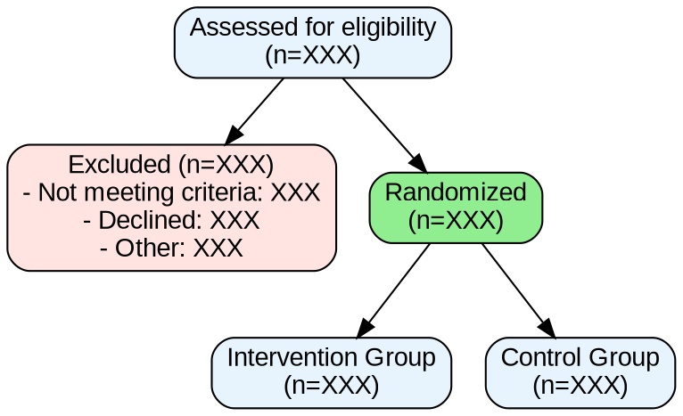

# 流程图自动绘制指南

> 适用于 PRISMA 2020、CONSORT 2025 等报告规范的流程图自动生成
> 更新日期: 2026-06-24

---

## 1. 流程图数据收集规范

### 1.1 CONSORT 流程图数据

| 阶段 | 需要收集的数据 | 数据格式 |
|------|-------------|---------|
| 入组 (Enrollment) | 符合条件人数、排除人数及原因、拒绝参与人数 | 整数 + 原因列表 |
| 分配 (Allocation) | 各组分配人数 | 整数 |
| 随访 (Follow-up) | 各组失访人数及原因 | 整数 + 原因列表 |
| 分析 (Analysis) | 各分析人群的人数 | 整数 |

### 1.2 PRISMA 2020 流程图数据

| 阶段 | 需要收集的数据 | 数据格式 |
|------|-------------|---------|
| 识别 (Identification) | 数据库检索结果数、去重后记录数 | 整数 |
| 筛选 (Screening) | 标题/摘要排除数及原因 | 整数 + 原因列表 |
| 资格评估 (Eligibility) | 全文评估排除数及原因 | 整数 + 原因列表 |
| 纳入 (Included) | 最终纳入研究数 | 整数 |

## 2. Mermaid 自动生成

### 2.1 CONSORT 流程图

```mermaid
flowchart TD
    A[Assessed for eligibility\n(n=XXX)] --> B[Excluded\n(n=XXX)]
    B --> B1[Not meeting criteria\n(n=XXX)]
    B --> B2[Declined to participate\n(n=XXX)]
    B --> B3[Other reasons\n(n=XXX)]
    
    A --> C[Randomized\n(n=XXX)]
    
    C --> D[Intervention Group\n(n=XXX)]
    C --> E[Control Group\n(n=XXX)]
    
    D --> D1[Received allocated intervention\n(n=XXX)]
    D --> D2[Did not receive\n(n=XXX)]
    
    E --> E1[Received allocated intervention\n(n=XXX)]
    E --> E2[Did not receive\n(n=XXX)]
    
    D1 --> D3[Lost to follow-up\n(n=XXX)]
    D1 --> D4[Discontinued intervention\n(n=XXX)]
    
    E1 --> E3[Lost to follow-up\n(n=XXX)]
    E1 --> E4[Discontinued intervention\n(n=XXX)]
    
    D3 --> F[Analyzed\n(n=XXX)]
    E3 --> G[Analyzed\n(n=XXX)]
    
    F --> F1[Excluded from analysis\n(n=XXX)]
    G --> G1[Excluded from analysis\n(n=XXX)]
```

### 2.2 PRISMA 2020 流程图

```mermaid
flowchart TD
    A[Records identified from databases\n(n=XXX)] --> B[Records after duplicates removed\n(n=XXX)]
    A2[Records identified from other sources\n(n=XXX)] --> B
    
    B --> C[Records screened\n(n=XXX)]
    C --> D[Records excluded\n(n=XXX)]
    
    C --> E[Reports sought for retrieval\n(n=XXX)]
    E --> F[Reports not retrieved\n(n=XXX)]
    
    E --> G[Reports assessed for eligibility\n(n=XXX)]
    G --> H[Reports excluded with reasons\n(n=XXX)]
    H --> H1[Reason 1\n(n=XXX)]
    H --> H2[Reason 2\n(n=XXX)]
    
    G --> I[Studies included in review\n(n=XXX)]
    I --> J[Reports included in meta-analysis\n(n=XXX)]
```

## 3. Graphviz 代码

### 3.1 CONSORT 流程图 (DOT 格式)



## 4. Python 自动生成

```python
def generate_consort_flowchart(data: dict) -> str:
    """
    生成 CONSORT 流程图 Mermaid 代码
    
    Parameters
    ----------
    data : dict
        {
            'assessed': int,
            'excluded': {'not_meeting': int, 'declined': int, 'other': int},
            'randomized': int,
            'intervention': {'allocated': int, 'received': int, 'lost': int, 'analyzed': int},
            'control': {'allocated': int, 'received': int, 'lost': int, 'analyzed': int},
        }
    
    Returns
    -------
    str : Mermaid 代码
    """
    excluded_total = sum(data['excluded'].values())
    
    mermaid = f"""flowchart TD
    A[Assessed for eligibility\n(n={data['assessed']})] --> B[Excluded\n(n={excluded_total})]
    B --> B1[Not meeting criteria\n(n={data['excluded']['not_meeting']})]
    B --> B2[Declined\n(n={data['excluded']['declined']})]
    B --> B3[Other reasons\n(n={data['excluded']['other']})]
    
    A --> C[Randomized\n(n={data['randomized']})]
    
    C --> D[Intervention\n(n={data['intervention']['allocated']})]
    C --> E[Control\n(n={data['control']['allocated']})]
    
    D --> F[Analyzed\n(n={data['intervention']['analyzed']})]
    E --> G[Analyzed\n(n={data['control']['analyzed']})]
"""
    return mermaid

# 使用示例
data = {
    'assessed': 500,
    'excluded': {'not_meeting': 120, 'declined': 80, 'other': 20},
    'randomized': 280,
    'intervention': {'allocated': 140, 'received': 138, 'lost': 5, 'analyzed': 135},
    'control': {'allocated': 140, 'received': 140, 'lost': 3, 'analyzed': 137},
}
print(generate_consort_flowchart(data))
```

## 5. R 自动生成

```r
# 使用 DiagrammeR 绘制流程图
library(DiagrammeR)

grViz("
digraph consort {
  graph [layout = dot, rankdir = TB]
  node [shape = box, style = rounded, fillcolor = '#E8F4FD']
  
  A [label = 'Assessed for eligibility\n(n = 500)']
  B [label = 'Excluded\n(n = 220)', fillcolor = '#FFE4E1']
  C [label = 'Randomized\n(n = 280)', fillcolor = '#90EE90']
  D [label = 'Intervention\n(n = 140)']
  E [label = 'Control\n(n = 140)']
  F [label = 'Analyzed\n(n = 135)']
  G [label = 'Analyzed\n(n = 137)']
  
  A -> B
  A -> C
  C -> D
  C -> E
  D -> F
  E -> G
}
")
```

## 6. 输出格式

| 格式 | 工具 | 适用场景 |
|------|------|---------|
| PNG/SVG | Mermaid CLI / Graphviz | 论文插图 |
| HTML | Mermaid.js | 交互式报告 |
| DOCX | python-docx + 绘图 | Word 文档 |
| LaTeX | TikZ / dot2tex | LaTeX 论文 |

## 参考文献

1. Page MJ, McKenzie JE, Bossuyt PM, et al. The PRISMA 2020 statement: an updated guideline for reporting systematic reviews. BMJ. 2021;372:n71.
2. Hopewell S, et al. CONSORT 2025 statement. BMJ. 2025;389:2024-081123.
