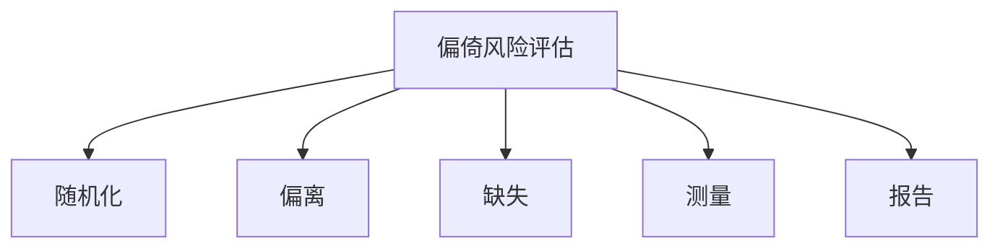

# Risk of Bias Assessment Template

> 偏倚风险评估表模板

---

## RoB 2 (随机对照试验)

| 研究 | D1: 随机化过程 | D2: 偏离干预 | D3: 缺失数据 | D4: 结局测量 | D5: 选择性报告 | 总体 |
|------|---------------|------------|------------|------------|--------------|------|
| [研究1] | 🟢/🟡/🔴 | 🟢/🟡/🔴 | 🟢/🟡/🔴 | 🟢/🟡/🔴 | 🟢/🟡/🔴 | 🟢/🟡/🔴 |

**图例**: 🟢 低风险 / 🟡 一些担忧 / 🔴 高风险

### 评估说明

#### 研究 1

**D1 随机化过程**: [说明]

**D2 偏离干预**: [说明]

**D3 缺失数据**: [说明]

**D4 结局测量**: [说明]

**D5 选择性报告**: [说明]

---

## ROBINS-I (非随机干预研究)

| 研究 | D1: 混杂 | D2: 选择 | D3: 分类 | D4: 偏离 | D5: 缺失 | D6: 测量 | D7: 报告 | 总体 |
|------|---------|---------|---------|---------|---------|---------|---------|------|
| [研究1] | 🟢/🟡/🔴 | 🟢/🟡/🔴 | 🟢/🟡/🔴 | 🟢/🟡/🔴 | 🟢/🟡/🔴 | 🟢/🟡/🔴 | 🟢/🟡/🔴 | 🟢/🟡/🔴 |

**图例**: 🟢 低风险 / 🟡 中等风险 / 🔴 高风险 / ⚫ 关键风险

---

## 偏倚风险摘要图

---

## 偏倚风险对结果影响讨论

[讨论偏倚风险评估结果对证据合成和结论的潜在影响]
